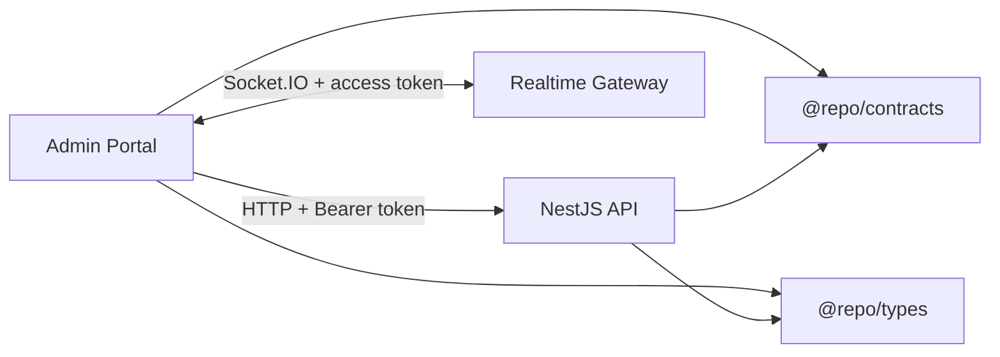
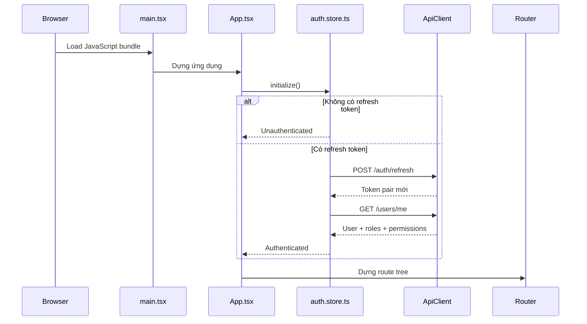
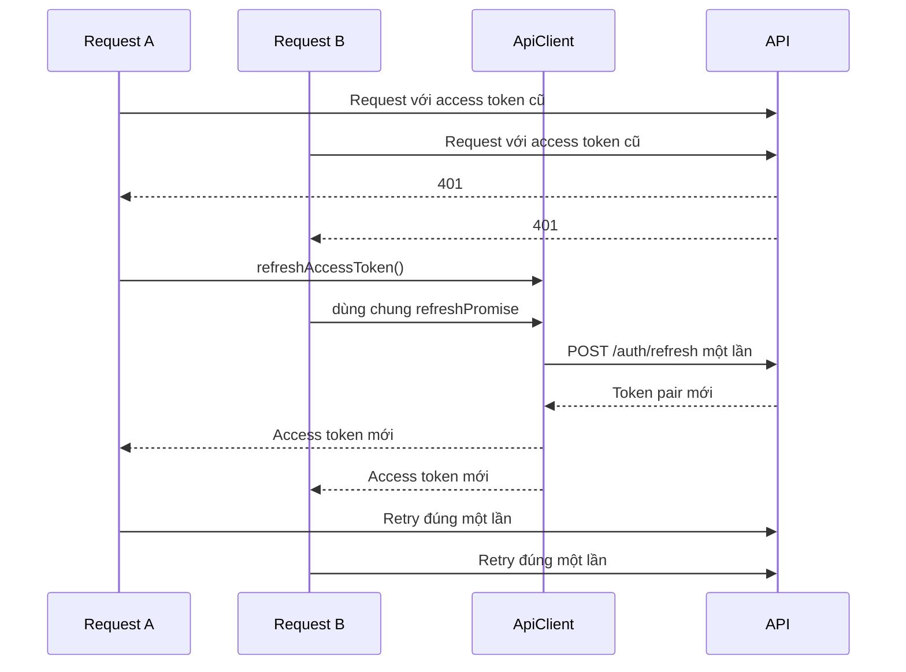

# Admin Portal

> **Phần II · Chương 7 — Admin từ click đến dữ liệu**
>
> Chương trước: [Backend Architecture](../server/README.md) · [Mục lục handbook](../../docs/README.md) · Chương sau: [Client Web](../client/README.md)

Chương này đi theo một thao tác nhìn thấy được: quản trị viên mở trang Users, lọc danh sách, tạo user và thấy giao diện cập nhật. Ta sẽ lần từ URL đến component, từ component đến API, rồi theo response quay lại màn hình.

Trong lúc đi, ta mới đặt tên cho ba loại dữ liệu: dữ liệu lấy từ server, trạng thái tạm của giao diện và bản sao dữ liệu được giữ trong cache. Khi server thay đổi, Admin phải đánh dấu bản sao cũ là hết hạn để tải lại; thao tác đó gọi là **cache invalidation**.

Admin là ứng dụng một trang (Single-Page Application, viết tắt SPA) chạy trong trình duyệt. Nó hiển thị dữ liệu và gửi yêu cầu của người dùng, nhưng backend mới là nơi quyết định thao tác có hợp lệ và được phép hay không.

Admin Portal là ứng dụng quản trị chạy trên trình duyệt của monorepo. Ứng dụng được xây bằng React 19, TypeScript, Vite, React Router, TanStack Query, Zustand, Tailwind CSS và các UI primitive dựa trên Radix.

Tài liệu này mô tả code đang tồn tại trong `apps/admin`, không mô tả một kiến trúc giả định. Mục tiêu là giúp một thành viên mới hiểu ứng dụng khởi động thế nào, request đi qua đâu, state thuộc về lớp nào, quyền được kiểm tra ở đâu và cần đặt code mới vào vị trí nào.

## 1. Admin chịu trách nhiệm gì?

Admin Portal là giao diện để con người sử dụng backend. Frontend trình bày dữ liệu, giữ trạng thái tương tác trên màn hình, gọi API, báo lỗi và ẩn những nút người dùng không có quyền sử dụng. Việc ẩn nút chỉ cải thiện trải nghiệm; backend vẫn xác thực danh tính và kiểm tra quyền lại ở mọi request.

Ứng dụng dùng hai package chung của monorepo:

- `@repo/contracts` cung cấp tên permission chuẩn như `PERMISSIONS.USER.READ`.
- `@repo/types` cung cấp các kiểu dữ liệu trao đổi như `User`, `Role`, `Permission`, `AuditLog` và `PaginatedResult`.

Nhờ vậy frontend không tự phát minh permission string hoặc tạo lại các response model đã được chia sẻ.



## 2. Kiến trúc tổng thể

Code nghiệp vụ được tổ chức theo feature; phần dùng chung được tổ chức theo lớp kỹ thuật (layer).

`features` chứa các vertical slice như users, roles và sessions. Mỗi feature đặt component màn hình cạnh hook truy cập dữ liệu của chính nó. `components` chứa UI dùng lại giữa nhiều feature và không biết auth hay nghiệp vụ. `lib` chứa client hạ tầng không phụ thuộc màn hình. `routes` là composition root của điều hướng. `app` chứa application boundary và composition có quyền phụ thuộc feature, gồm access control, authenticated shell, cache policy và realtime lifecycle. `hooks` chỉ còn hook kỹ thuật dùng chung, không đọc business state.

```text
src/
├── app/
│   ├── access/                 # Permission evaluator và UI guard
│   ├── shell/                  # Layout/navigation/notification sau đăng nhập
│   ├── auth-cache-boundary.ts # Xóa server cache khi principal thay đổi
│   └── realtime/              # Socket client, event handlers và lifecycle provider
├── components/
│   ├── ui/                     # UI primitive, không chứa nghiệp vụ
│   └── *.tsx                   # Pattern dùng chung: page, error, pagination...
├── features/
│   ├── auth/                   # Đăng nhập, khôi phục phiên, auth state
│   ├── dashboard/              # Chỉ số tổng quan
│   ├── users/                  # Quản lý tài khoản
│   ├── roles/                  # Ma trận vai trò và quyền
│   ├── sessions/               # Phiên đăng nhập và thu hồi
│   ├── audit/                  # Nhật ký quản trị
│   └── notifications/          # Query và mutation thông báo
├── hooks/                      # Hook kỹ thuật dùng chung, ví dụ responsive
├── i18n/                       # Translation resource cho lỗi
├── lib/                        # API client, error mapping, utilities
├── routes/                     # Route tree và protected route
├── App.tsx                     # Provider composition và auth bootstrap
└── main.tsx                    # Browser entry point
```

Đây là kiến trúc feature-based modular frontend, không phải Clean Architecture đầy đủ. UI component gọi feature hook; feature hook gọi `ApiClient`; contracts/types dùng chung đóng vai trò bản hợp đồng hai phía giữa frontend và backend. Cách chia này phù hợp với quy mô hiện tại vì flow của một nghiệp vụ có thể được đọc trong một thư mục mà không cần đi qua nhiều layer hình thức.

## 3. Flow khởi động ứng dụng

Entry point là `src/main.tsx`. File này nạp CSS, khởi tạo i18n rồi render `App` trong React `StrictMode`.

`App.tsx` là composition root phía client. Nó tạo một `QueryClient`, gắn theme provider, query provider, router và toaster. Ngay khi mount, `App` gọi `authStore.initialize()` để khôi phục phiên trước khi render route tree.

`QueryClient` không được cấu hình riêng trong từng component. `src/app/query-client.ts` giữ chính sách chung cho dữ liệu lấy từ server.

Query đọc dữ liệu được thử lại tối đa hai lần nếu lỗi có khả năng tạm thời: mất mạng, HTTP 408, 429 hoặc 5xx. Các lỗi 4xx khác không được tự thử lại vì request hoặc quyền truy cập đang sai; chờ thêm không làm kết quả thay đổi.

Thao tác ghi dữ liệu (mutation) cũng không tự retry. Server có thể đã ghi thành công nhưng response bị mất trên đường về; gửi lại mù quáng có thể tạo tác dụng phụ hai lần. Mỗi feature phải hiển thị lỗi và để người dùng chủ động quyết định thử lại.



Trong thời gian bootstrap, `App` hiển thị loading toàn màn hình. Điều này ngăn router chuyển nhầm người dùng sang `/login` trước khi quá trình khôi phục phiên hoàn thành.

## 4. Routing, layout và code splitting

`src/routes/route-manifest.ts` là nguồn duy nhất giữ metadata của route quản trị: URL, nhãn breadcrumb và permission bắt buộc. `src/routes/index.tsx` ghép metadata đó với page được lazy import để tạo route tree. Cách tách này giúp layout, router và kiểm tra quyền cùng đọc một định nghĩa; khi thêm hoặc đổi route, breadcrumb không bị lệch khỏi router.

Các màn hình được lazy import, vì vậy trình duyệt chỉ tải code của feature khi route tương ứng được mở.

Route công khai gồm `/login` và `/403`. Tất cả route quản trị nằm bên dưới `ProtectedRoute`, sau đó dùng `MainLayout`. Mỗi route có thể khai báo một permission và được bọc bởi `PermissionGuard`.

Khi người chưa đăng nhập mở thẳng một URL quản trị, `ProtectedRoute` chuyển họ tới `/login` và giữ lại vị trí nội bộ ban đầu. Đăng nhập thành công đưa họ trở lại đúng pathname, query string và hash đó; nếu không có vị trí hợp lệ thì về dashboard. Redirect chỉ chấp nhận path nội bộ bắt đầu bằng đúng một dấu `/`, không nhận URL tuyệt đối hoặc `//host`, để state điều hướng không trở thành open redirect.

Flow quyết định truy cập là:

```text
URL
  → ProtectedRoute: người dùng đã đăng nhập chưa?
  → MainLayout: render navigation và Outlet
  → PermissionGuard: có permission của route không?
  → Feature page
```

`ProtectedRoute` chỉ quyết định người dùng đã đăng nhập hay chưa. Realtime không thuộc một trang cụ thể mà thuộc toàn ứng dụng, nên `RealtimeProvider` quản lý kết nối.

Provider chỉ mở socket sau khi auth store xác nhận đã đăng nhập và có access token. Khi logout hoặc ứng dụng tháo provider khỏi cây React, nó gỡ listener rồi đóng socket.

Access token của Socket.IO chỉ đi trong `handshake.auth.token`, không nằm trong query string để tránh URL hoặc proxy log ghi lại bearer credential. Khi HTTP refresh thành công, event `auth:token-refreshed` cập nhật `socket.auth`; lần reconnect kế tiếp luôn dùng token mới.

Khi thêm page mới, feature export page qua `pages.ts`. Sau đó thêm URL, nhãn và permission vào `route-manifest.ts`, rồi nối URL với lazy page trong `routes/index.tsx`. TypeScript sẽ báo lỗi nếu manifest có route nhưng bảng page chưa có phần tử tương ứng. Permission phải lấy từ `@repo/contracts`, không viết string trực tiếp. `index.ts` và `pages.ts` có mục đích khác nhau: `index.ts` là capability/API dùng chéo; `pages.ts` là entry chỉ dành cho lazy route. Không export page từ `index.ts`, vì một import tĩnh vào capability có thể kéo page vào initial bundle và phá code splitting.

## 5. Đăng nhập và vòng đời token

Authentication state thuộc `features/auth/store/auth.store.ts`. Zustand store giữ `user`, `isAuthenticated` và trạng thái bootstrap. Access token chỉ nằm trong memory của `ApiClient`; refresh token nằm trong cookie `HttpOnly` do server quản lý — JavaScript không đọc/ghi được, trình duyệt tự gửi kèm khi gọi các endpoint `/auth/*` (mọi request của `ApiClient` bật `credentials: "include"`).

### Đăng nhập

`LoginForm` gọi `authStore.login()`. Store gửi credentials tới `/auth/login`, lưu token pair, sau đó gọi `/users/me`. Chỉ khi lấy được user thành công store mới chuyển sang authenticated.

Login là một transition nguyên khối ở phía client: nếu `/auth/login` thành công nhưng `/users/me` thất bại, store xóa access token, giữ trạng thái unauthenticated và gọi `/auth/logout` theo best effort để thu hồi refresh session vừa tạo. Lỗi profile ban đầu vẫn được trả về UI; lỗi cleanup không được phép che mất nguyên nhân chính.

### Khôi phục phiên sau reload

Access token biến mất khi reload vì nó chỉ nằm trong memory. `initialize()` đọc refresh token, gọi `/auth/refresh` để đổi lấy cặp token mới (rotate), rồi tải `/users/me`. Nếu bất kỳ bước nào thất bại, local token bị xóa và ứng dụng trở về trạng thái chưa đăng nhập.

### Refresh tự động khi API trả 401

Mọi feature dùng `lib/api-client.ts`. Nếu protected request trả `401`, client tạo một singleton `refreshPromise`. Những request 401 đồng thời cùng chờ promise này thay vì mỗi request gửi một refresh riêng.



Request retry được đánh dấu `skipRefresh`, do đó một response 401 tiếp theo sẽ trở thành `ApiError` thay vì tạo vòng lặp vô hạn.

Nếu refresh thất bại, `ApiClient` xóa token và phát event `auth:logout`. `App` nhận event, dọn auth store và điều hướng về `/login`. Nếu refresh thành công, client phát `auth:token-refreshed`; `RealtimeProvider` cập nhật `socket.auth` để lần reconnect tiếp theo dùng token mới.

### Thuộc tính bảo mật của mô hình cookie

Refresh token nằm trong cookie `HttpOnly`, vì vậy JavaScript không thể đọc và gửi credential sống dài sang máy khác. Ở production cookie còn có `Secure` và chỉ được gửi tới path `/auth`.

`HttpOnly` không giải quyết mọi dạng XSS. Mã độc đang chạy ngay trong tab vẫn có thể gọi `/auth/refresh`, vì trình duyệt tự đính cookie. Do đó code vẫn phải tránh render HTML chưa làm sạch và phải kiểm soát dependency phía trình duyệt.

Khi Admin và API cùng một site, backend dùng `SameSite=Lax`. Nếu hai ứng dụng nằm ở hai site khác nhau, cookie phải dùng `SameSite=None` cùng `Secure`, nhưng một số browser vẫn chặn cookie bên thứ ba. Production nên dùng các subdomain chung một domain, chẳng hạn `admin.example.com` và `api.example.com`.

## 6. Server state và UI state

TanStack Query sở hữu dữ liệu đến từ server: users, roles, permissions, sessions, audit logs, dashboard stats và notifications. Zustand chỉ sở hữu authentication state có phạm vi toàn ứng dụng. State điều hướng cần chia sẻ hoặc khôi phục khi reload, như bộ lọc và trang hiện tại của danh sách users, nằm trong URL. State tương tác thoáng qua như modal đang mở hoặc lựa chọn chưa submit nằm trong component.

Cache server được xem là dữ liệu thuộc về principal đang đăng nhập, không phải cache dùng chung cho cả tab. `app/auth-cache-boundary.ts` theo dõi transition từ authenticated sang unauthenticated và gọi `QueryClient.clear()`. Vì vậy logout, force logout hoặc refresh token hết hạn đều loại bỏ dữ liệu của phiên cũ trước khi một tài khoản khác đăng nhập trong cùng tab.

Quy tắc xác định nơi sở hữu state:

| Loại state         | Công cụ        | Ví dụ                       |
| ------------------ | -------------- | --------------------------- |
| Server state       | TanStack Query | danh sách users, roles      |
| Session toàn cục   | Zustand        | current user, authenticated |
| URL/navigation     | React Router   | route, page và search       |
| Interaction cục bộ | `useState`     | modal, draft form           |
| Theme              | Theme provider | light/dark/system           |

Mỗi feature có query-key factory, ví dụ `userKeys.list({ page, limit, search })`. Factory bảo đảm cùng một loại dữ liệu luôn dùng cùng một key trong cache, và cung cấp root key như `userKeys.all` để khi mutation cần làm mới cache, mọi biến thể phân trang đều được làm mới mà không phải lặp lại chuỗi key ở nhiều nơi.

Mutation thành công phải `await queryClient.invalidateQueries(...)`. Promise mutation chỉ resolve sau khi cache liên quan đã được đánh dấu stale và các active query hoàn tất refetch; form không được báo hoàn thành trong khi màn hình vẫn còn dữ liệu cũ. Mutation thất bại hiển thị lỗi nhưng không invalidate dữ liệu đang hợp lệ.

Query screen phải phân biệt bốn trạng thái: loading, error có retry, empty và success. `components/query-error-state.tsx` là pattern dùng chung để lỗi mạng không bị hiển thị nhầm thành dữ liệu rỗng.

### Flow quản lý người dùng

`UserTable` đọc `q` và `page` từ query string rồi truyền chúng vào `useUsers`. Ô tìm kiếm giữ draft cục bộ trong lúc gõ, debounce 300 ms, sau đó cập nhật URL và đưa trang về 1. Vì URL là nguồn sự thật nên đường dẫn có thể bookmark, reload và dùng Back/Forward mà không mất ngữ cảnh danh sách.

`UserTable.tsx` chỉ điều phối URL, capability và dialog. `UsersDataTable.tsx` trình bày loading/error/empty/data cùng row action; `UserSearchInput.tsx` sở hữu search draft và timer; `UserFormFields.tsx` là field set semantic dùng chung cho create/edit. Create và edit vẫn có submit handler riêng vì create bắt buộc password còn edit định danh user và không gửi password. Cả hai form giữ role dưới dạng `string[]` giống contract backend và dùng nhóm checkbox để chọn nhiều role. Vì update là replace operation, form edit phải khởi tạo toàn bộ role hiện tại; chỉ giữ role đầu tiên sẽ làm mất quyền khi người vận hành sửa một field không liên quan. Cách tách này loại markup trùng nhưng không trộn page state, server state và field state.

`useUsers` là application hook của feature. Hook sở hữu query danh sách, mutation tạo/sửa/khóa/xóa và invalidation. Danh sách role chỉ được tải khi principal có quyền mở form tạo hoặc sửa; người dùng read-only không phát sinh request `/roles` trái quyền ở background. Lỗi tải role được hiển thị thành trạng thái retry trong form, không được biến âm thầm thành danh sách rỗng.

Form tạo và sửa validate cùng các bất biến công khai của backend trước khi gửi: email hợp lệ, username dài 3–50 ký tự, mật khẩu tạo mới tối thiểu 6 ký tự và phải chọn ít nhất một role. Create mặc định chọn `USER` nếu role này tồn tại; Edit không tự thêm role giả định mà phản chiếu đúng tập role backend trả về. Đây là lớp phản hồi sớm cho UX; backend vẫn là security/domain boundary cuối cùng.

Avatar chỉ nhận JPG, PNG, WEBP hoặc GIF tối đa 5 MB, đúng bằng giới hạn của endpoint `POST /storage/upload`. Sau khi upload, Admin chỉ chấp nhận đường dẫn bắt đầu bằng `/` do API trả về hoặc URL tuyệt đối dùng HTTP(S). Một resolver dùng chung ghép đường dẫn nội bộ với `VITE_API_URL`, nên form và bảng người dùng luôn hiển thị avatar theo cùng một quy tắc. Nếu upload lỗi hoặc storage trả URL không hợp lệ, giá trị avatar hiện tại được giữ nguyên.

Trong bảng Users, tài khoản đang đăng nhập có nhãn “Tài khoản của bạn”. Giao diện không hiển thị công tắc trạng thái và nút xóa cho hàng này, nhưng vẫn cho sửa thông tin nếu có quyền. Đây là UX guard để tránh thao tác nhầm; backend độc lập chặn cả tự toggle, tự deactivate và tự delete bằng error contract `USER_SELF_MUTATION_FORBIDDEN`.

Backend còn bảo vệ một invariant rộng hơn UI: hệ thống luôn phải còn ít nhất một user mang role `ADMIN`, đang active và chưa bị xóa. Vì vậy bỏ role `ADMIN`, deactivate, chuyển sang inactive hoặc xóa administrator cuối cùng đều trả `LAST_ADMINISTRATOR_REQUIRED` (HTTP 409). Admin UI không tự suy đoán ai là “người cuối cùng”, vì dữ liệu có thể đổi đồng thời; nó gửi command và hiển thị lỗi nghiệp vụ do transaction backend quyết định.

Create/Edit User gửi toàn bộ role đang được chọn. Form bắt buộc chọn ít nhất một role; backend vẫn tải lại role catalog và từ chối toàn bộ request nếu có tên không tồn tại hoặc đã bị xóa. Không được coi danh sách role là “gợi ý” rồi âm thầm lưu những tên hợp lệ, vì giao diện sẽ hiển thị một kết quả khác với command người vận hành vừa gửi.

Trang và từ khóa tìm kiếm nằm trong URL. Nếu mutation hoặc thay đổi dữ liệu làm `page` hiện tại lớn hơn `totalPages` mới, `UserTable` dùng replace navigation để đưa URL về trang cuối còn tồn tại mà vẫn giữ từ khóa. Nếu không hiệu chỉnh, xóa user cuối cùng của một trang có thể để người vận hành mắc kẹt ở một bảng rỗng dù trang trước vẫn có dữ liệu.

Các thao tác phá hủy hoặc đổi trạng thái phải chờ Promise mutation hoàn tất. `ConfirmDialog` giữ dialog mở, khóa nút trong lúc pending, chỉ đóng sau khi mutation và cache invalidation thành công; nếu thất bại dialog giữ nguyên ngữ cảnh để người dùng thử lại. Không được dùng mutation fire-and-forget cho flow cần xác nhận.

Users mutations trả cả pending tổng và identity đang xử lý (`changingStatusUserId`, `deletingUserId`). Bảng dùng identity để thông báo đúng row; action xung đột vẫn bị khóa trong thời gian command chạy. Switch trên UI chọn một trong hai intent rõ ràng là `activate` hoặc `deactivate`; backend không cung cấp endpoint toggle phụ thuộc trạng thái hiện tại. Form create/edit chỉ đóng sau khi mutation cùng invalidation thành công. Lỗi mutation do hook thông báo, còn draft form được giữ nguyên để sửa hoặc thử lại.

### Flow quản lý vai trò và quyền

Màn hình Roles ghép hai server query độc lập: danh sách role và catalog permission. Chỉ khi cả hai nguồn thành công mới có thể dựng ma trận chính xác; lỗi của một nguồn đưa màn hình về error state có retry cả hai. Permission được nhóm theo `module` để người vận hành đọc ma trận theo bounded capability thay vì một danh sách phẳng.

Form tạo role là UI state của `RolesManagement`; `useRoles` chỉ nhận command đã chuẩn hóa và quản lý mutation/cache. Form phản chiếu constraint backend: tên dài 2–50 ký tự, mô tả tối đa 255 ký tự. Hai role hệ thống `ADMIN` và `USER` không bao giờ hiển thị thao tác xóa; backend vẫn kiểm tra lại invariant này.

Khi người vận hành chọn hoặc bỏ một checkbox, màn hình mới chỉ sửa bản nháp của cột vai trò đó; chưa có request nào được gửi. Nút **Lưu** gửi toàn bộ tập quyền trong bản nháp lên backend, còn **Hủy** bỏ bản nháp và trả checkbox về dữ liệu gần nhất từ server. Nếu request lưu thất bại, bản nháp được giữ lại để người vận hành có thể kiểm tra và thử lại.

API cập nhật quyền là một replace operation: mảng gửi lên trở thành toàn bộ tập quyền mới của vai trò, không phải danh sách các quyền cần thêm hoặc bớt. Backend kiểm tra tất cả tên quyền trước khi thay thế; chỉ một tên không tồn tại cũng khiến cả request bị từ chối và dữ liệu cũ được giữ nguyên. Khi tập quyền thực sự thay đổi, backend cập nhật quan hệ role-permission và tăng `tokenVersion` của tất cả user đang mang vai trò đó trong cùng một transaction. Access token cũ của những user này vì thế bị thu hồi.

Khi một request tiếp theo nhận lỗi token đã bị thu hồi, API client dùng refresh cookie để lấy access token mới rồi phát sự kiện `auth:token-refreshed`. `App.tsx` nhận sự kiện và tải lại `/users/me`. Bước tải lại này rất quan trọng: token mới chỉ sửa thông tin xác thực gửi lên server, còn `/users/me` mới cập nhật danh sách role và permission trong Zustand để route, menu và nút thao tác phản ánh quyền mới. Việc refresh token thành công nhưng bỏ qua user snapshot sẽ làm giao diện tiếp tục hiển thị quyền cũ.

Trong lúc một vai trò đang được lưu, ma trận được khóa để ngăn hai replace operation chồng lên nhau. Backend cũng từ chối xóa vai trò đang được gán cho user; người vận hành phải chuyển các user sang vai trò phù hợp trước rồi mới xóa.

Nhóm permission được đóng/mở bằng `button` có `aria-expanded`, dùng được bằng bàn phím. Ma trận nằm trong vùng cuộn ngang để số lượng role tăng lên không làm cắt mất cột hoặc phá layout.

### Flow quản lý phiên đăng nhập

Access token mang JTI của refresh session đã sinh ra nó. `GET /auth/sessions` so sánh JTI này với các session trong Redis và trả `isCurrent`, nhờ đó Admin đánh dấu “Phiên hiện tại” và không hiển thị thao tác tự thu hồi phiên đang dùng.

Backend đối chiếu JTI của mọi access token với session trong Redis ở từng authenticated request. Vì vậy xóa một session làm cả refresh token và access token của thiết bị đó bị từ chối ngay, không có khoảng chờ 15 phút. Điều này cũng có nghĩa Redis là dependency fail-closed của request đã đăng nhập: backend không được bỏ qua kiểm tra session khi Redis gặp sự cố.

“Hủy tất cả phiên khác” gọi `POST /auth/sessions/revoke-others` bằng refresh cookie HttpOnly. Backend xóa mọi Redis session ngoại trừ định danh ổn định của phiên hiện tại, không clear cookie và không tăng `tokenVersion`; tab hiện tại vì vậy tiếp tục hoạt động. Endpoint này tuyệt đối không được thay bằng `/auth/logout/global`: global logout xóa toàn bộ session, tăng token version và kết thúc cả tab đang thao tác.

Ở tầng lưu trữ, backend không nhận diện phiên hiện tại chỉ bằng refresh JTI vì JTI đổi sau mỗi lần rotate. Mỗi lần đăng nhập có thêm một `sessionId` ổn định và mọi thế hệ refresh token của cùng thiết bị giữ nguyên id đó. Nhờ vậy một request refresh chạy đồng thời với “Hủy tất cả phiên khác” không làm backend xóa nhầm phiên vừa được xoay vòng.

Danh sách Sessions dùng `page` trong URL làm nguồn sự thật. Revoke mutation trả Promise tới `ConfirmDialog`; dialog chỉ đóng sau khi cache session đã invalidate/refetch. Nút của session đang xử lý bị khóa để tránh gửi lặp.

Mỗi session mới có deadline tuyệt đối 7 ngày tính từ lần login và màn hình hiển thị thời điểm “Hết hạn”. Refresh rotation không đẩy deadline này ra xa hơn. Field deadline là optional trong shared frontend type để Admin vẫn đọc được các session Redis cũ; backend suy ra deadline cũ từ `createdAt` trong lần refresh kế tiếp.

### Flow đọc Audit Logs

Audit là màn hình read-only. `q` và `page` nằm trong URL, vì vậy một cuộc điều tra có thể được bookmark hoặc gửi cho người khác mà vẫn giữ đúng từ khóa và trang. Search draft debounce 300 ms trong `AuditSearchInput`; sau đó component cập nhật URL và reset page. `useAuditLogs` chỉ sở hữu server query/cache, không giữ UI state.

Presentation của audit được tách khỏi query: `audit-log.presentation.ts` ánh xạ action code ổn định sang nhãn, icon và severity; action chưa biết vẫn hiển thị bằng fallback thay vì làm hỏng timeline. `AuditLogDetails` trình bày details, actor, IP, user-agent và mã truy vết bằng cấu trúc semantic. Mã truy vết chính là `x-correlation-id` của request ghi audit; operator có thể copy nó sang hệ thống log để xem toàn bộ HTTP/outbox/queue flow. Bản ghi cũ chưa có mã hiển thị “Không có”, không dựng UUID giả. Timestamp vừa có chuỗi địa phương hóa để đọc, vừa giữ ISO gốc trong thuộc tính `dateTime`.

Backend hiện bảo đảm search trên action, details, email và correlation ID. UI không cung cấp filter theo ngày/action hoặc export giả lập khi contract chưa hỗ trợ; các khả năng đó phải được thiết kế thành API có phân trang, authorization và giới hạn dữ liệu trước.

### Notification đi từ server đến màn hình như thế nào?

Popover tải 50 notification mới nhất nhưng badge dùng `unreadCount` do backend đếm trên toàn bộ mailbox; không được đếm mảng page hiện tại. Mark-one và mark-all cập nhật cache lạc quan để UI phản hồi ngay, giữ snapshot để rollback khi request thất bại, rồi invalidate root key sau thành công. Trong lúc một mutation đang chạy, các action notification còn lại bị khóa để không tạo hai snapshot lạc quan chồng lên nhau và rollback sai thứ tự. Mutation lỗi được hook chuyển thành toast và được click handler giữ lại tại UI boundary, vì vậy browser không phát sinh unhandled Promise rejection sau khi rollback đã hoàn tất.

Mỗi notification chưa đọc là một semantic button có accessible name và dùng được bằng bàn phím. Notification đã đọc bị disabled vì không còn action. Bell nối unread count bằng `aria-describedby`; badge `9+` chỉ là biểu diễn thị giác và bị ẩn khỏi accessibility tree. Popover có heading, loading status và error alert được đặt tên rõ ràng. Timestamp hiển thị tương đối nhưng giữ ISO gốc trong `dateTime`. Realtime event chỉ invalidate cache và hiển thị toast; HTTP response vẫn là nguồn sự thật.

Shared shell đọc breadcrumb từ route manifest, vì vậy nhãn và route guard không có hai danh sách độc lập. Header và content padding thay đổi theo breakpoint; active navigation nhận diện cả route con nhưng không nhầm `/users-archive` là con của `/users`.

Sidebar tải thứ tự, nhóm, nhãn và icon từ `/menus`, sau đó đối chiếu từng URL với route manifest. Backend quyết định menu nào tồn tại và chúng được sắp xếp ra sao; route manifest frontend là nguồn duy nhất quyết định permission nào cần để mở từng màn hình. Nhờ vậy sidebar và route guard không thể lệch nhau nếu metadata permission trong menu cũ hoặc sai. URL không tồn tại trong frontend, item không có quyền và group rỗng đều không được render. Icon backend chưa được frontend hỗ trợ dùng biểu tượng `Shield` an toàn. Trong lúc tải, sidebar hiển thị trạng thái loading; nếu request lỗi, người dùng thấy thông báo cùng nút thử lại; nếu tải thành công nhưng không còn item hợp lệ, sidebar giải thích rằng tài khoản chưa có menu được cấp quyền.

User menu tách “Đăng xuất” khỏi “Đăng xuất mọi thiết bị”. Trong lúc một action đang chạy, cả hai lựa chọn bị khóa để tránh gửi request lặp. Router chỉ thay history bằng `/login` sau khi auth store đã hoàn thành local cleanup; lỗi bất ngờ được giữ tại event boundary và hiển thị bằng toast thay vì tạo unhandled rejection. Avatar không có ảnh dùng initials tính từ tên người dùng, không dùng chữ viết tắt hard-code.

## 7. Permission model

Permission được kiểm tra ở ba cấp:

1. Route-level guard quyết định người dùng có được mở màn hình.
2. Capability map (bảng gom các permission thành những "khả năng" có tên rõ nghĩa) quyết định một nhóm hành vi có được hiển thị hay không.
3. Component `Can` bảo vệ thao tác cụ thể như tạo, sửa hoặc xóa.

Ví dụ semantic capability map:

```tsx
const access = usePermissions({
  canCreateUser: PERMISSIONS.USER.CREATE,
  canManageUsers: [PERMISSIONS.USER.UPDATE, PERMISSIONS.USER.DELETE],
});
```

Mảng permission có nghĩa là “có ít nhất một quyền”. Vì thế mảng `any` rỗng bị từ chối thay vì vô tình cho phép. Tập `all` rỗng vẫn đúng theo nghĩa không còn điều kiện bắt buộc. Nếu một capability khai báo cả `all` và `any`, người dùng phải thỏa toàn bộ nhóm `all` và ít nhất một phần tử của nhóm `any`. Không khai báo requirement mới là trường hợp công khai trong vùng đã đăng nhập.

Array trong semantic map mang nghĩa `any`: chỉ cần người dùng có ít nhất một quyền trong danh sách là capability được coi là đúng. Nếu cần tất cả quyền, dùng `{ all: [...] }`. Nếu cần bất kỳ quyền nào một cách tường minh, dùng `{ any: [...] }`.

Kiểm tra permission ở frontend chỉ phục vụ trải nghiệm người dùng. Nó không phải hàng rào bảo mật; backend vẫn phải từ chối request trái quyền.

Màn hình nghiệp vụ phải có integration test với ít nhất một principal read-only và các tổ hợp mutation permission quan trọng. Test query control bằng accessible name để đồng thời khóa permission visibility và khả năng sử dụng bằng assistive technology; icon-only action như sửa hoặc xóa bắt buộc có `aria-label`.

## 8. Realtime flow

Realtime là một application boundary trong `src/app/realtime`, được tách thành ba phần có trách nhiệm độc lập:

- `realtime-client.ts` biết cách tạo Socket.IO client và cập nhật credential. Access token chỉ được gửi qua `handshake.auth`, không nằm trong URL/query string. Client được tạo với `autoConnect: false`.
- `realtime-event-handlers.ts` ánh xạ transport event sang application side effect như logout, toast, observability và invalidation cache.
- `realtime-provider.tsx` sở hữu lifecycle: đọc auth state, tạo đúng một socket cho phiên authenticated, đăng ký toàn bộ listener trước khi gọi `connect()`, nghe token refresh và cleanup toàn bộ resource khi phiên kết thúc. Handshake được defer một task để lần cleanup kiểm tra của React `StrictMode` có thể hủy socket chưa dùng trước khi browser mở kết nối; lần mount còn sống mới tạo handshake thật.

Client xử lý ba nhóm event:

- `force_logout`: hiển thị cảnh báo và chạy logout.
- `notification_received`: hiển thị toast và invalidate query `["notifications"]`.
- `notification`: hiển thị toast realtime tổng quát.

Handshake auth thất bại có mã `REALTIME_AUTHENTICATION_FAILED`. Trường hợp này nghĩa là credential không còn hợp lệ nên Admin logout và dọn session. `connect_error` không có mã đó được xem là lỗi transport tạm thời: client ghi nhận qua observability nhưng không phá phiên HTTP, còn Socket.IO tiếp tục reconnect theo policy của nó. Không được logout chỉ vì Wi-Fi chập chờn hoặc API đang restart.

Feature component không được tự tạo socket. Khi thêm event mới, khai báo handler trong `realtime-event-handlers.ts`; nếu event dẫn tới thay đổi server state, handler phải invalidate query bằng query-key factory của feature thay vì lặp chuỗi key. Provider chỉ điều phối lifecycle và không chứa logic trình bày của từng event.

## 9. Trách nhiệm của các file chính

| File hoặc thư mục                             | Trách nhiệm                                                           |
| --------------------------------------------- | --------------------------------------------------------------------- |
| `src/main.tsx`                                | Điểm vào trên trình duyệt: nạp CSS và khởi tạo i18n                   |
| `src/App.tsx`                                 | Lắp ráp provider, khôi phục phiên, xử lý logout toàn cục              |
| `src/app/query-client.ts`                     | Policy cache, retry và retry delay dùng chung cho server state        |
| `src/app/realtime/realtime-client.ts`         | Tạo socket và cập nhật token cho lần reconnect                        |
| `src/app/realtime/realtime-event-handlers.ts` | Ánh xạ realtime event sang toast, logout và cache invalidation        |
| `src/app/realtime/realtime-provider.tsx`      | Sở hữu vòng đời socket theo trạng thái authentication                 |
| `src/routes/index.tsx`                        | Khai báo mọi route, nạp trang kiểu lazy và gắn permission cho route   |
| `src/routes/protected-route.tsx`              | Chặn người chưa đăng nhập; không sở hữu hạ tầng realtime              |
| `src/lib/api-client.ts`                       | Gắn header, xử lý JSON, dịch lỗi, tự refresh token và retry request   |
| `src/lib/error-handler.ts`                    | Chuyển lỗi kỹ thuật thành message thân thiện                          |
| `src/lib/observability.ts`                    | Chuẩn hóa, redact và chuyển lỗi tới telemetry sink                    |
| `src/features/auth/store/auth.store.ts`       | Đăng nhập, đăng xuất, khôi phục phiên và giữ thông tin user hiện tại  |
| `src/app/access/usePermission.tsx`            | Kiểm tra permission; cung cấp `Can` và `PermissionGuard`              |
| `src/app/shell`                               | Authenticated layout, navigation, user và notification controls       |
| `src/components/ui`                           | UI primitive; không gọi API và không chứa business rule               |
| `src/components/*.tsx`                        | Các mẫu giao diện dùng lại giữa nhiều feature                         |
| `src/features/*/api/*.api.ts`                 | Nơi duy nhất của feature biết endpoint backend và kiểu dữ liệu vào/ra |
| `src/features/*/api/*.keys.ts`                | Sinh query key để định danh dữ liệu của feature trong cache           |
| `src/features/*/hooks`                        | Gọi API qua query/mutation và làm mới cache của feature               |
| `src/features/*/components`                   | Giữ trạng thái tương tác và hiển thị màn hình nghiệp vụ               |
| `src/features/*/index.ts`                     | Public capability/API dùng bởi app hoặc feature khác                  |
| `src/features/*/pages.ts`                     | Public route entry, chỉ được nạp bằng lazy import                     |

## 10. Cách thêm một feature chuẩn (mini-tutorial)

Giả sử cần thêm feature `projects`. Một feature chuẩn gồm đúng 4 nhóm file, và ta sẽ viết từng file theo đúng khuôn của feature `users` đang có. Nguyên tắc xuyên suốt: **component không biết endpoint, hook không biết URL, chỉ api adapter biết backend**.

### Bước 1 — API adapter: nơi DUY NHẤT biết endpoint

`features/projects/api/project.api.ts`:

```ts
import type { PaginatedResult } from "@repo/types";
import { ApiClient } from "@/lib/api-client";
import type { ProjectListParams } from "./project.keys";

export interface Project {
  id: string;
  name: string;
  description: string | null;
  createdAt: string;
}

export interface CreateProjectInput {
  name: string;
  description?: string;
}

const getProjects = ({ page, limit, search }: ProjectListParams) => {
  const params = new URLSearchParams({
    page: String(page),
    limit: String(limit),
  });
  if (search) params.set("search", search);
  return ApiClient.get<PaginatedResult<Project>>(`/projects?${params}`);
};

export const projectApi = {
  getProjects,
  create: (input: CreateProjectInput) =>
    ApiClient.post<Project>("/projects", input),
};
```

`ApiClient` tự gắn access token và tự refresh khi 401 — feature không phải bận tâm.

### Bước 2 — Query key factory: "địa chỉ nhà" của cache

`features/projects/api/project.keys.ts`:

```ts
export interface ProjectListParams {
  page: number;
  limit: number;
  search: string;
}

export const projectKeys = {
  all: ["projects"] as const,
  lists: () => [...projectKeys.all, "list"] as const,
  list: (params: ProjectListParams) =>
    [...projectKeys.lists(), params] as const,
};
```

Vì sao phải có file này? Vì key gõ tay ở hai nơi mà lệch nhau một ký tự là cache và invalidation "nhìn không thấy nhau" — bug rất khó lần.

### Bước 3 — Hook: nối api + keys thành query/mutation

`features/projects/hooks/useProjects.ts`:

```ts
import { useQuery, useMutation, useQueryClient } from "@tanstack/react-query";
import { toast } from "sonner";
import { getFriendlyErrorMessage } from "@/lib/error-handler";
import { projectApi } from "../api/project.api";
import { projectKeys } from "../api/project.keys";

export const useProjects = (options?: { page?: number; search?: string }) => {
  const queryClient = useQueryClient();
  const params = {
    page: options?.page || 1,
    limit: 10,
    search: options?.search || "",
  };

  const projectsQuery = useQuery({
    queryKey: projectKeys.list(params),
    queryFn: () => projectApi.getProjects(params),
    staleTime: 30000,
  });

  const createProjectMutation = useMutation({
    mutationFn: projectApi.create,
    onSuccess: (created) => {
      // Báo cache "nhóm projects đã cũ" → danh sách tự refetch
      queryClient.invalidateQueries({ queryKey: projectKeys.all });
      toast.success(`Đã tạo dự án "${created.name}"!`);
    },
    onError: (error: unknown) => {
      toast.error(`Không thể tạo dự án: ${getFriendlyErrorMessage(error)}`);
    },
  });

  return { projectsQuery, createProjectMutation };
};
```

### Bước 4 — Component, barrel và route

`components/ProjectsManagement.tsx` chỉ gọi `useProjects()` và lo 4 trạng thái hiển thị (loading / error có nút retry / empty / success). Vì đây là route page, xuất nó qua `features/projects/pages.ts`:

```ts
export { ProjectsManagement } from "./components/ProjectsManagement";
```

Thêm permission `PROJECT.READ`/`PROJECT.CREATE` vào `@repo/contracts` (backend seed cùng chuỗi đó), rồi khai báo route trong `routes/index.tsx`:

```tsx
{
  path: "/projects",
  permission: PERMISSIONS.PROJECT.READ,
  element: lazyPage(() => import("@/features/projects/pages")),
}
```

Navigation phải dùng cùng permission với route — nếu không sẽ hiện link mà người dùng bấm vào chỉ nhận trang 403.

### Checklist feature đúng chuẩn (kèm lý do)

- Không import trực tiếp code nội bộ của feature khác — **vì** ESLint sẽ chặn, và deep-import biến hai feature thành một khối không tách được nữa.
- Feature khác chỉ được import capability qua `features/<name>/index.ts`; route chỉ import `features/<name>/pages.ts` — **vì** hai public entry tách dependency dùng chéo khỏi code page cần lazy-load.
- UI primitive không phụ thuộc feature nghiệp vụ — **vì** button/dialog phải tái sử dụng được ở mọi feature, kể cả feature chưa ra đời.
- Không duplicate response type nếu là contract backend–frontend — **vì** hai bản copy sẽ lệch nhau đúng lúc backend đổi field.
- Không dùng `any` để vượt type boundary — **vì** `any` lây: một chỗ `any` làm mọi chỗ chạm vào nó mất kiểm tra kiểu.
- Mutation có pending state, success feedback, friendly error, cache invalidation — **vì** thiếu invalidation thì UI hiển thị dữ liệu cũ như thể thao tác thất bại.
- Query đủ 4 trạng thái loading / retryable error / empty / success — **vì** màn hình trắng khi lỗi mạng là bug, không phải "edge case".
- Icon-only control có accessible name — **vì** screen reader chỉ đọc được text, không đọc được hình.
- Business action nhạy cảm có xác nhận UI và authorization backend — **vì** ẩn nút chỉ là trải nghiệm; kẻ xấu gọi thẳng API, chốt chặn thật nằm ở server.

## 11. Testing

Vitest chạy trong jsdom, kèm Testing Library cho component test (setup ở `src/test/setup.ts`). Các nhóm test nền tảng hiện có:

1. `src/lib/api-client.test.ts` — khóa chặt hành vi refresh: hai request 401 đồng thời chỉ tạo một refresh request; refresh thất bại phải xóa session và phát logout; retry vẫn 401 không được refresh lặp vô hạn.
2. `src/app/access/usePermission.test.tsx` — render `<Can>` với các tổ hợp quyền: có quyền thì hiện, thiếu thì hiện fallback, `all`/`any` đúng ngữ nghĩa, cấu hình `any` rỗng fail-closed, và hành vi công khai khi không khai báo requirement.
3. `src/features/auth/components/LoginForm.test.tsx` cùng `src/features/auth/utils/login-redirect.test.ts` — submit gọi `login` đúng credentials, khôi phục URL nội bộ sau đăng nhập và từ chối redirect ra ngoài; lỗi hiển thị thông báo thân thiện và ở lại trang; nút ẩn/hiện mật khẩu có accessible name.
4. `src/features/auth/store/auth.store.test.ts` — khóa transition login, rollback/revoke khi profile không tải được và local cleanup khi logout gặp lỗi mạng.
5. `src/routes/protected-route.test.tsx` — phân biệt đúng bootstrap pending, unauthenticated redirect có giữ URL ban đầu và authenticated outlet.
6. `src/app/auth-cache-boundary.test.ts` — bảo đảm cache server bị xóa khi principal đăng xuất nhưng không bị xóa bởi update auth state không liên quan.
7. `src/app/realtime/realtime-client.test.ts` — khóa chặt việc token chỉ đi qua Socket.IO auth payload và có thể được thay sau HTTP refresh.
8. `src/app/realtime/realtime-event-handlers.test.ts` — xác nhận event được ánh xạ đúng sang logout, toast, cache invalidation và mọi listener đều được tháo.
9. `src/app/realtime/realtime-provider.test.tsx` — xác nhận socket chỉ sống trong phiên authenticated, nhận token mới và được cleanup khi provider unmount.
10. `src/features/dashboard/components/DashboardCharts.test.tsx` — bảo đảm biểu đồ có tên accessible, giá trị chính xác có thể đọc mà không cần nhìn màu/hình và zero dataset có empty state rõ ràng.
11. `src/features/dashboard/components/DashboardOverview.test.tsx` — khóa blocking loading state, partial failure của health/audit và hành vi refresh đồng thời ba nguồn dữ liệu độc lập.
12. `src/app/query-client.test.ts` — khóa retry policy: chỉ lỗi tạm thời được retry, có giới hạn; mutation không bao giờ tự phát lại.
13. `src/routes/route-error-page.test.ts` — bảo đảm route boundary không rò thông điệp kỹ thuật hoặc dữ liệu nhạy cảm ra giao diện.

`pnpm test` chạy kèm coverage và fail nếu tụt dưới sàn khai báo trong `vitest.config.ts` (hiện là 63% statements, 62% branches, 54% functions và 64% lines). Quy tắc ratchet: phủ thêm test thì nâng sàn lên theo, không bao giờ hạ sàn để cho qua.

Test mới nên đặt cạnh source khi test một unit hoặc module nhỏ. Integration test của một feature có thể đặt trong thư mục feature. Ưu tiên test behavior nhìn thấy từ public API thay vì private implementation.

### Browser E2E

Playwright trong `e2e/` kiểm tra các boundary chỉ xuất hiện khi toàn hệ thống chạy cùng nhau. Suite hiện khởi động NestJS và Vite thật, kết nối PostgreSQL/Redis thật và kiểm tra bằng Chromium:

1. Người chưa xác thực mở protected route bị chuyển về login.
2. Login admin tạo refresh cookie `HttpOnly`; reload trang gọi `/auth/refresh` và khôi phục phiên.
3. Principal có role `USER` mở route chỉ dành cho admin nhìn thấy forbidden boundary.
4. Admin deactivate một user đang kết nối; outbox/realtime gateway phát `force_logout` và browser trở về login.

Test tạo user qua public API thay vì chọc trực tiếp database. Local suite dùng database disposable `admin_browser_e2e`, tách hoàn toàn khỏi `starter_db`; script chuẩn bị luôn drop rồi tạo lại đúng database này để phiên, outbox event và dữ liệu từ lần chạy trước không làm test phụ thuộc thứ tự. `.env.e2e` chỉ chứa credential test local, tuyệt đối không dùng cho staging hoặc production.

## 12. Lệnh phát triển và quality gate

Chạy từ thư mục gốc monorepo:

```bash
pnpm --filter=admin dev
pnpm --filter=admin lint
pnpm --filter=admin check-types
pnpm --filter=admin test
pnpm e2e:admin
pnpm --filter=admin build
pnpm --filter=admin verify
```

Dev server mặc định chạy ở `http://localhost:5173`. Backend URL lấy từ `VITE_API_URL`. Chỉ mode `development` và `test` được fallback về `http://localhost:3001`; production build thiếu biến, dùng URL sai định dạng, protocol khác HTTP(S), hoặc trỏ localhost đều fail ngay. Copy `.env.example` thành `.env.local` cho local override. Mọi biến `VITE_*` được đóng vào browser bundle nên chỉ chứa public configuration, tuyệt đối không chứa token, key hoặc secret.

`verify` là quality gate nhanh: lint, unit/integration test, TypeScript build và Vite production build. `pnpm e2e:admin` là gate xuyên hệ thống: lệnh bật Postgres/Redis, tái tạo database E2E, migrate, seed, rồi Playwright tự quản lý API `3101` và Admin dev server `5174`. Cổng E2E riêng ngăn reuse nhầm process development `3001/5173`. Lần chạy đầu cần tải Chromium bằng `pnpm --filter=admin exec playwright install chromium`.

`VITE_API_URL=https://api.example.com pnpm --filter=admin verify:production` build artifact rồi kiểm tra CSP, absence của localhost/source map, Vercel output directory, SPA rewrite và security-header contract. CI chạy cùng verifier sau monorepo build.

### Vercel deployment contract

Admin và Client là hai Vercel project độc lập. Admin project đặt **Root Directory** là `apps/admin`; framework là Vite; output là `dist`. Không tạo project `web` hoặc project ở repository root. Git integration tự build preview/production; `apps/admin/vercel.json` sở hữu SPA rewrite và browser headers.

Mỗi Vercel environment phải có `VITE_API_URL` riêng:

| Vercel scope | Giá trị                                              |
| ------------ | ---------------------------------------------------- |
| Development  | API local hoặc development                           |
| Preview      | API staging/preview có CORS cho preview Admin origin |
| Production   | API HTTPS production; không localhost                |

Vite sinh CSP meta từ origin này: `connect-src` chỉ cho chính Admin origin, API HTTP(S) và Socket.IO WS(S); `img-src` cho API origin để hiển thị avatar. Admin dùng system font, không tải stylesheet/font từ CDN, nên `font-src` vẫn giữ ở `'self' data:`. `vercel.json` bổ sung `nosniff`, frame deny, referrer policy, permissions policy, COOP, cache immutable cho hashed assets và no-cache cho HTML. CSP không có `unsafe-eval`; `unsafe-inline` chỉ còn ở `style-src` vì UI primitives dùng inline style. Khi thêm external font/image/telemetry endpoint phải sửa generator và test, không nới thành `https:` hoặc `*`.

Direct navigation tới `/users`, `/roles` và các route SPA khác được rewrite về `index.html`; static assets vẫn do Vercel filesystem phục vụ. Production source maps bị tắt và verifier cấm file `.map` trong artifact.

Trên CI, browser E2E chạy thành job riêng với PostgreSQL/Redis disposable và upload trace, screenshot, video, HTML report khi cần chẩn đoán. Job build/publish image chỉ được chạy sau quality, backend E2E và Admin browser E2E.

## 13. Những điểm cần tiếp tục cải thiện

Dashboard lấy ba nguồn độc lập: thống kê nghiệp vụ, `/health/ready` làm mới mỗi 30 giây và audit trail gần đây. Thống kê là boundary chính nên lỗi của nó hiển thị full-page retry; health hoặc audit lỗi chỉ làm widget tương ứng chuyển sang unknown/retry, không che dữ liệu còn dùng được. Nút tải lại refetch cả ba nguồn.

Hai biểu đồ đơn giản dùng SVG/CSS nội bộ thay cho Recharts. Trước thay đổi, chart lazy chunk là 378.16 kB (107.94 kB gzip); sau thay đổi toàn bộ route Dashboard là 13.34 kB (4.41 kB gzip), không còn chart chunk riêng. SVG có accessible name, giá trị theo ngày hiện bằng text và phân bổ role dùng semantic meter, nên thông tin không phụ thuộc tooltip, chuột hoặc màu sắc.

Vendor đã được tách theo nhịp thay đổi (`react-vendor`, `data-vendor`, `i18n-vendor`, `realtime-vendor`) để deploy code ứng dụng không làm hỏng cache của thư viện. Muốn đo lại trước khi chỉnh tiếp: `ANALYZE=1 pnpm --filter=admin build` rồi mở `dist/stats.html`. Ngưỡng cảnh báo kích thước chunk đặt ở 350 kB để chunk phình lên là biết ngay.

Authentication đã dùng HttpOnly refresh cookie, access token trong memory, single-flight refresh và rollback cho login dở dang. Browser E2E đã khóa login, cookie refresh qua reload, RBAC route và force logout qua WebSocket trên topology local/CI thật. Khoảng trống tiếp theo là kiểm thử topology production có TLS và domain/subdomain thật.

Test suite đã bảo vệ application bootstrap, MainLayout/breadcrumb, user-menu logout, global logout, việc tháo các global subscription, API client, auth store, route guard, permission evaluator, cache boundary, realtime boundary, permission visibility của các màn hình quản trị chính và mutation/invalidation của users, roles, sessions và notifications. Browser suite bảo vệ các flow quan trọng nhất qua frontend, API, cookie, database, Redis và WebSocket thật.

Application resilience hiện có ba tầng. Lỗi render vượt khỏi feature được chặn bởi `ApplicationErrorBoundary`; lỗi lazy route/loader được chặn bởi `RouteErrorPage`; lỗi server state dự kiến được feature hiển thị bằng `QueryErrorState`. Boundary không đưa raw `Error.message` ra người dùng vì message kỹ thuật có thể chứa endpoint, identifier hoặc dữ liệu nhạy cảm.

Mọi lỗi cấp boundary đi qua `reportError()` trong `src/lib/observability.ts`, không gọi trực tiếp SDK của một vendor. Reporter tạo incident ID, timestamp, source, operation và route; nếu lỗi đến từ backend, `ApiClient` lấy `x-correlation-id` từ response và reporter giữ giá trị này để nối browser incident với backend log/outbox/job. Trước khi chuyển payload, reporter redact bearer token, JWT và các assignment mang tên password, secret, token, authorization hoặc cookie. Sink lỗi bị cô lập để telemetry outage không thể làm hỏng user flow.

Sink mặc định phát browser event `admin:observability-error`; development đồng thời in structured report để debug. Khi chọn Sentry, OpenTelemetry collector hoặc provider khác, composition root chỉ cần gọi `configureObservabilitySink(report => provider.capture(report))`. Feature và boundary không import provider SDK.

Mọi sink được cấu hình đều đi qua hai giới hạn in-memory mặc định: tối đa 50 report trong một cửa sổ 60 giây và tối đa 5 report có cùng fingerprint. Fingerprint dùng source, loại lỗi, message đã redact, route và operation; nó cố ý không dùng incident ID, timestamp hoặc correlation ID vì các giá trị duy nhất này sẽ phá deduplication. Khi cửa sổ hết hạn hoặc clock quay lùi, counter được reset. Có thể truyền policy khác qua tham số thứ hai của `configureObservabilitySink`, nhưng giá trị phải là số nguyên dương. Đây là cầu chì phía browser, không thay sampling/quota của provider. Custom sink vẫn phải gửi bất đồng bộ và không bổ sung raw request body, header hoặc auth state vào report.
