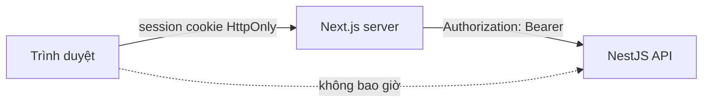
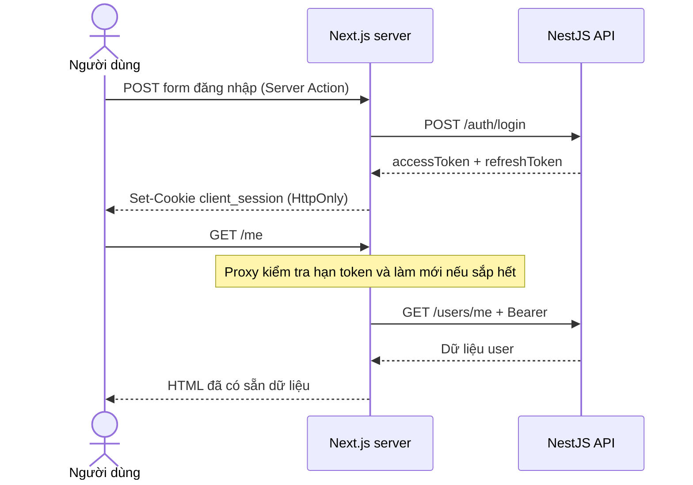

# Client Web Application

> **Phần II · Chương 8 — Client Web và ranh giới server/browser**
>
> Chương trước: [Admin Portal](../admin/README.md) · [Mục lục handbook](../../docs/README.md) · Chương sau: [Auth context](../server/src/contexts/iam/auth/README.md)

Admin và Client cùng dùng dữ liệu từ một backend nhưng phục vụ hai hoàn cảnh khác nhau. Admin là công cụ nội bộ chạy trong trình duyệt. Client có trang công khai cần máy tìm kiếm đọc được và có những trang được dựng sẵn ở server. Vì vậy không thể sao chép nguyên kiến trúc của Admin sang Next.js.

Client hiện chỉ là một ví dụ nhỏ để chứng minh cách chia trách nhiệm, chưa phải sản phẩm hoàn chỉnh. Trình duyệt không giữ access token. Thay vào đó, trình duyệt gọi Next.js; Next.js giữ phiên và gọi NestJS API thay cho trình duyệt. Một server đứng giữa và phục vụ riêng nhu cầu của frontend như vậy được gọi là **Backend for Frontend (BFF)**.

Ứng dụng dành cho người dùng cuối, xây bằng Next.js App Router. Client tồn tại trong repo này để làm hai việc mà Admin SPA không làm được: **render nội dung ở phía server cho máy tìm kiếm đọc được**, và **giữ token hoàn toàn ngoài tầm với của JavaScript trình duyệt**.

> Gặp từ lạ? Tra [Bảng thuật ngữ](../../docs/glossary.md).

## 1. Mô hình BFF: vì sao khác Admin

Admin là SPA: trình duyệt giữ access token trong bộ nhớ và gọi thẳng API. Client đi hướng ngược lại — **Backend-for-Frontend**: trình duyệt chỉ nói chuyện với Next.js, và chỉ server Next.js nói chuyện với NestJS API.



Hệ quả cụ thể:

|                                     | Admin (SPA + bearer) | Client (BFF)             |
| ----------------------------------- | -------------------- | ------------------------ |
| Nơi giữ access token                | Bộ nhớ JavaScript    | Cookie HttpOnly của Next |
| Ai gọi API                          | Trình duyệt          | Server Next.js           |
| Có cần CORS không                   | Có                   | Không                    |
| Dựng nội dung đã đăng nhập ở server | Không                | Có                       |
| XSS lấy được token không            | Có thể               | Không                    |

Đây không phải "cách đúng hơn" một cách tuyệt đối — đó là đánh đổi. **Chọn SPA + bearer** khi làm màn hình nội bộ sau đăng nhập, tương tác nhiều, không quan tâm SEO. **Chọn BFF** khi có trang công khai cần SEO, hoặc khi muốn token không bao giờ chạm trình duyệt.

## 2. Vòng đời một phiên đăng nhập

Trước login có thể có một bước xác minh email. Form `/register` gọi backend qua Server Action, không gọi API trực tiếp từ browser. Nếu backend trả `emailVerificationRequired=true`, Client chuyển người dùng tới `/check-email`; liên kết trong mail mở `/verify-email?token=...`, và Server Action gửi token tới endpoint confirm. Màn hình check-email cũng có form gửi lại link. Response gửi lại luôn nói chung chung để giao diện không tiết lộ email nào đã tồn tại.

Khi policy backend đang tắt, đăng ký chuyển thẳng tới `/login?registered=1`. Khi policy bật, login bằng đúng password nhưng email chưa xác minh hiển thị hướng dẫn gửi lại link. Client chỉ trình bày trạng thái; backend mới là nơi quyết định có được cấp token hay không.



Next.js không cho code ghi cookie trong lúc render trang. Cookie chỉ được thay đổi ở Proxy, Server Action hoặc Route Handler. Vì vậy [`proxy.ts`](proxy.ts) chịu trách nhiệm làm mới phiên.

Proxy đọc thời điểm hết hạn (`exp`) của access token. Nó chỉ dùng thông tin này để biết khi nào cần gọi `/auth/refresh`; API vẫn là nơi xác minh token có thật sự hợp lệ hay không. Nếu token còn dưới 60 giây, Proxy xin token mới và gắn cookie mới vào response.

Nhiều request có thể cùng phát hiện token sắp hết hạn. `lib/refresh-session.ts` gom các request trong cùng một Next.js instance vào chung một Promise, nên chỉ có một HTTP refresh được gửi. Cách gom việc trùng nhau này gọi là **single-flight**.

Nếu hệ thống chạy nhiều Next.js instance, mỗi instance vẫn có thể gửi một refresh. Backend xử lý tình huống này theo hai bước trong cùng một thao tác Redis nguyên tử: request đầu tiên xoay session và lưu kết quả trong 5 giây; request đến sau với đúng token cũ nhận lại chính kết quả đó. Vì cả hai response ghi cùng một cặp token nên không còn chuyện một replica vô tình đăng xuất người dùng. Single-flight giảm request thừa trong một instance; Redis giải quyết race giữa các instance.

## 3. Cấu trúc

```text
apps/client/
├── app/
│   ├── (public)/             # Route công khai
│   ├── (auth)/               # Login/register/verify/reset, chỉ compose Auth feature
│   └── (protected)/          # Layout và route cần session
├── features/
│   ├── auth/                 # Login/logout action và form
│   ├── account/              # Current-user query và account shell
│   └── README.md             # Quy tắc tạo feature mới
├── lib/
│   ├── session.ts            # Đọc/ghi cookie phiên (server-only)
│   ├── refresh-session.ts    # Single-flight refresh trong một Next instance
│   ├── safe-redirect.ts      # Chỉ cho phép redirect tới path nội bộ
│   └── api.ts                # Gọi API kèm bearer token (server-only)
└── proxy.ts                  # Chặn route riêng tư + làm mới token
```

`lib/*` đánh dấu `import "server-only"`: nếu ai lỡ import chúng vào Client Component thì build fail ngay, thay vì âm thầm gửi token xuống trình duyệt.

Chiều phụ thuộc là `app → features → lib/packages`. `app/` không chứa nghiệp vụ và feature không import ngược từ `app/`. Cấu trúc theo chiều dọc này giữ code của một use case gần nhau; đọc login không phải nhảy giữa thư mục action, component và helper dùng chung. Xem [quy ước feature module](features/README.md) trước khi thêm nghiệp vụ Client.

## 4. Chạy ở local

Cần API chạy sẵn (`pnpm dev:server`) và một file `.env.local`:

```dotenv
API_URL=http://localhost:3001
SESSION_SECRET=chuỗi-ngẫu-nhiên-tối-thiểu-32-ký-tự
```

Sinh secret ngẫu nhiên bằng:

```powershell
node -e "console.log(require('crypto').randomBytes(32).toString('base64url'))"
```

Cả hai biến **không có tiền tố `NEXT_PUBLIC_`** — chỉ server đọc được. Development được phép fallback về API local và khóa session cố định; production thiếu biến, secret ngắn hơn 32 ký tự, URL sai định dạng hoặc trỏ localhost đều làm build/startup thất bại. Preview và Production trên Vercel phải có `API_URL` và `SESSION_SECRET` scope riêng; không dùng secret production cho Preview.

Next.js có thể nạp code server khi `next build` thu thập dữ liệu route, nên production build cũng phải nhận đủ hai biến. Quality CI dùng API giả `https://api.ci.example.invalid` và một secret chỉ dành cho test để xác nhận contract; chúng không phải thông tin đăng nhập và không được sao chép sang môi trường triển khai. `API_URL` cùng `SESSION_SECRET` nằm trong `globalEnv` của Turbo vì thay đổi chúng phải làm mất hiệu lực build cache của Client.

`next.config.ts` áp CSP, frame deny, nosniff, referrer policy, permissions policy, COOP và HSTS cho mọi route. CSP production chỉ cho resource cùng origin, không có wildcard hoặc `unsafe-eval`; development thêm `unsafe-eval` cho Next.js tooling. Client dùng `next/font`, nên font Google được self-host trong artifact thay vì browser gọi CDN.

```powershell
pnpm dev:client            # http://localhost:3005
pnpm --filter=client test  # test cho Proxy, session, api (vitest)
pnpm --filter=client e2e   # acceptance test qua Chromium, Next BFF và API thật
```

Phần được test kỹ nhất chính là phần dễ sai nhất: [`proxy.test.ts`](proxy.test.ts) dựng request giả với token sắp hết hạn để kiểm tra đủ nhánh làm mới (thành công, API từ chối, API sập), còn [`lib/session.test.ts`](lib/session.test.ts) ném dữ liệu rác vào `decodeSession` để chắc chắn cookie bị sửa tay không làm crash trang.

Browser E2E kiểm tra phần nối giữa các lớp mà unit test không thể chứng minh: Playwright tự khởi động backend E2E ở cổng `3101` và Client ở cổng `3006`, đăng nhập qua Server Action, quan sát cookie `client_session` HttpOnly, tải hồ sơ SSR, reload rồi logout. Test còn xác nhận browser không gọi trực tiếp tới API. Local cần PostgreSQL, Redis và dữ liệu seed E2E; GitHub Actions tự dựng các dependency dùng một lần trong job **Frontend browser E2E**. Khi lỗi, trace, screenshot, video và HTML report được lưu làm artifact trong 7 ngày.

Suite còn dựng một cookie JWE hợp lệ chứa access token đã hết hạn và refresh token thật. Cách này kiểm tra được lifecycle production mà không phải rút ngắn TTL backend hoặc thêm endpoint chỉ dành cho test: Proxy phải refresh trước khi render `/me`; refresh token đã revoke phải làm cookie BFF bị xóa; hai navigation đồng thời phải dùng chung kết quả refresh để token dùng một lần không bị consume hai lần. Kết quả thành công được giữ trong bộ nhớ 5 giây — đủ cho request đã mang cookie cũ tới cùng runtime, nhưng failure không được cache và token không tồn tại lâu dài ngoài JWE/Redis.

### Route groups và account shell

`app` chia route theo mục đích mà không đổi URL:

```text
app/
├── (public)/page.tsx
├── (auth)/login/
└── (protected)/
    ├── layout.tsx
    ├── _components/account-shell.tsx
    └── me/page.tsx
```

`(protected)` không có nghĩa là Admin. Đây là khu vực tài khoản của người dùng cuối. Proxy kiểm tra/refresh session trước khi render; protected layout kiểm tra lại session, lấy current user một lần và dựng header/navigation/user menu; page feature chỉ render nghiệp vụ của nó. `getCurrentUser()` dùng React request cache, nên layout và page cùng cần user vẫn chỉ gọi backend một lần trong server render hiện tại. Cache này không tồn tại xuyên request và không dùng chung giữa người dùng.

Khi thêm route tài khoản mới, đặt page dưới `(protected)` và thêm URL prefix vào matcher bảo vệ trong `proxy.ts` để token được refresh trước SSR. Hai lớp này cải thiện điều hướng và cấu trúc UI; backend vẫn phải kiểm tra ownership/authorization cho từng resource.

Kiểm chứng nhanh rằng mô hình đang hoạt động đúng:

```bash
# Nội dung nằm sẵn trong HTML (SEO) chứ không phải do JavaScript vẽ ra
curl -s http://localhost:3005/ | grep "<title>"

# Trang riêng tư khi chưa đăng nhập bị chặn ngay từ Proxy
curl -s -o /dev/null -w "%{http_code}\n" http://localhost:3005/me   # 307 → /login
```

## 5. Ghi chú về bảo mật của session cookie

Cookie `client_session` chứa cả access token lẫn refresh token, được **mã hóa** theo chuẩn JWE (thuật toán `dir` + `A256GCM`, thư viện `jose`) bằng khóa sinh từ `SESSION_SECRET`. Nghĩa là:

- Ai xem trộm được giá trị cookie (log, proxy, backup…) cũng **không đọc được token bên trong**.
- Sửa dù một byte là giải mã thất bại — người dùng chỉ đơn giản bị coi như chưa đăng nhập, không có cách "chế" cookie giả.
- Đổi `SESSION_SECRET` là toàn bộ phiên cũ mất hiệu lực ngay (mọi người phải đăng nhập lại) — đây cũng chính là nút "đăng xuất tất cả" khẩn cấp.

Giới hạn còn lại đúng bằng bản chất của mọi session cookie: kẻ trộm được **nguyên vẹn** cookie thì vẫn dùng được phiên. Chống chuyện đó là việc của `HttpOnly` (XSS không đọc được), `Secure` (không đi qua HTTP thường) và `SameSite=Lax`. Nếu cần thu hồi từng phiên một, hướng nâng cấp là session store phía server (Redis) và chỉ đặt session id vào cookie.

Khi nhiều tab cùng làm mới token trong một Next.js instance, single-flight gom chúng thành một request. Khi hai request đi tới hai instance khác nhau, flow là:

1. Instance A gửi refresh trước. Redis xóa JTI cũ, tạo JTI mới và giữ cặp token kết quả trong 5 giây như một bản replay ngắn hạn.
2. Instance B gửi cùng refresh token cũ. Backend không tạo thêm token hay session; nó trả lại đúng cặp token A đã nhận.
3. Hai response ghi cùng một session cookie, vì vậy thứ tự browser nhận response không làm phiên bị hỏng.

Bản replay chỉ là cầu nối cho các request đã cùng khởi hành với cookie cũ. Hết 5 giây, token cũ lại bị từ chối như bình thường. Logout, revoke một session, revoke các session khác và global logout đều xóa replay liên quan để kết quả ngắn hạn không thể khôi phục một session đã bị chủ động thu hồi.

Logout không chỉ xóa cookie BFF. Server Action đọc refresh token trong session, gọi `POST /auth/logout` để revoke JTI trong Redis, rồi luôn xóa cookie trong `finally`. Nếu API tạm thời không truy cập được, cookie phía trình duyệt vẫn bị xóa để người dùng thoát khỏi thiết bị hiện tại; session Redis sẽ hết TTL hoặc được operator/user thu hồi sau.

Tham số `next` sau login chỉ được nhận khi là path nội bộ bắt đầu bằng đúng một dấu `/`. URL tuyệt đối, URL dạng protocol-relative `//host` và giá trị encode thành `//host` đều bị đưa về `/me`; invariant này ngăn open redirect/phishing.

## 6. Resilience boundary của App Router

Client dùng bốn file convention ở root `app`: `loading.tsx` hiển thị trạng thái chuyển route; `error.tsx` chặn lỗi
render trong route và cho phép retry bằng `reset()`; `global-error.tsx` thay cả root layout khi layout không thể render;
`not-found.tsx` cung cấp trang 404 có đường quay về. Error UI không hiển thị raw `Error.message`, token, endpoint hoặc
stack trace cho người dùng. `error.tsx` và `global-error.tsx` là Client Component vì nút retry cần event handler;
loading và not-found vẫn là Server Component.

### Error contract giữa Next.js và API

`lib/api.ts` là một anti-corruption layer nhỏ: nó không để mỗi page hoặc Server Action tự diễn giải `fetch`. Mọi request có timeout 10 giây và mọi failure được đổi thành `ApiError` có cùng hình dạng:

- `kind` cho UI quyết định hành vi, chẳng hạn yêu cầu đăng nhập lại, báo không có quyền hay cho phép thử lại;
- `status`, `code` và `translationKey` dành cho code phía server chẩn đoán/ánh xạ nghiệp vụ;
- `retryable` phân biệt lỗi tạm thời như timeout, mất mạng, HTTP 429/5xx với lỗi người dùng không nên gửi lại nguyên trạng;
- `correlationId` lấy từ header `x-correlation-id`, dùng để nối lỗi người dùng gặp với đúng request trong backend log.

Raw `message`, stack trace và `details` từ backend không được sao chép vào error hiển thị. `toPublicApiError()` chỉ tạo object nhỏ gồm `kind`, thông điệp an toàn và correlation ID; Server Action dùng object này khi cần trả failure về Client Component. Correlation ID không phải secret: giao diện có thể cho người dùng sao chép nó khi liên hệ hỗ trợ, nhưng không tự hiển thị code nội bộ hay token.

```text
NestJS response / network failure
              │
              ▼
     lib/api.ts phân loại
              │
      ┌───────┴────────┐
      ▼                ▼
 ApiError server   PublicApiError
 status/code       kind/message/
 retryable         correlationId
      │                │
 logging/flow      Server Action → UI
```

Không catch rồi biến mọi lỗi thành “không tìm thấy”. Server Component nên để lỗi hạ tầng bất ngờ đi tới `error.tsx`; chỉ xử lý tại chỗ khi feature thực sự có một trạng thái nghiệp vụ tương ứng. Server Action phải gọi `toPublicApiError()` trước khi trả lỗi về browser và đặt `redirect()` bên ngoài `try/catch`, vì redirect của Next.js hoạt động bằng một control-flow exception.

### Form và Server Action contract

`lib/action-state.ts` định nghĩa ba trạng thái tuần tự hóa được: `idle`, `error` và `success`. Failure tách `fieldErrors` khỏi `formError`: lỗi định dạng email nằm cạnh ô email, còn sai thông tin đăng nhập hoặc API tạm thời mất kết nối nằm ở đầu form. Giá trị không nhạy cảm có thể được trả lại qua `values`; mật khẩu không bao giờ được echo từ Server Action về browser.

Login kiểm tra lại dữ liệu ở Server Action dù input đã có thuộc tính HTML. Browser validation chỉ cải thiện trải nghiệm và có thể bị bỏ qua; server validation mới là ranh giới tin cậy. Sau khi validation pass, action gọi API qua `apiFetchPublic()`, lưu session rồi mới `redirect()` bên ngoài `try/catch`. Khi API lỗi, form nhận thông điệp an toàn và correlation ID; code nội bộ, token và raw response không vượt qua ranh giới server/client.

Password recovery dùng hai public route. `/forgot-password` gửi email qua Server Action và luôn hiển thị cùng một kết quả thành công; UI không được xác nhận email nào có tài khoản. Link mail mở `/reset-password?token=...`; token chỉ đi từ search param vào hidden field rồi qua Server Action tới API, không được ghi log hay lưu cookie. Mật khẩu mới tối thiểu 12 ký tự và phải nhập khớp hai lần. Thành công không tự đăng nhập: backend đã thu hồi mọi thiết bị, nên người dùng quay lại `/login` bằng credential mới.

Mỗi input lỗi dùng `aria-invalid` và `aria-describedby`; form-level failure dùng `role="alert"`. Khi tạo form mới, tái sử dụng `ActionState` nhưng định nghĩa union tên field riêng cho feature, thay vì dùng một object lỗi không kiểu hoặc catch mọi lỗi thành cùng một chuỗi.

### Observability của BFF

Mỗi lần `lib/api.ts` gọi NestJS, BFF sinh hoặc tiếp tục header `x-correlation-id`. Backend dùng lại mã đó trong response và structured log, nên một lỗi có thể được lần từ form Client sang đúng request API. Khi request thất bại, `lib/observability.ts` ghi event JSON `client.bff.api_failed` gồm method, path đã bỏ query string, loại lỗi, status, thời gian và khả năng retry.

Event không chứa request body, cookie, Authorization, email, password, raw backend message hay stack. Adapter mặc định ghi JSON ra stderr để chạy trên Vercel, container hoặc VPS; sink có thể nối sang OpenTelemetry/Sentry sau này bằng `configureBffObservabilitySink()` mà API boundary và feature không phụ thuộc SDK vendor. Sink ném lỗi luôn bị cô lập để telemetry outage không biến một API failure thành BFF failure mới.

Vì API outage có thể làm mọi request cùng lỗi, adapter giới hạn mặc định 100 failure event trong mỗi cửa sổ 60 giây và 5 event có cùng fingerprint. Fingerprint chỉ gồm method, path đã bỏ query, kind và status; correlation ID không tham gia vì mỗi request có ID riêng. Event vượt giới hạn không biến mất hoàn toàn: adapter phát `client.bff.api_failures_suppressed` khi số bị nén đạt 1, 2, 4, 8... Nhờ vậy log vẫn cho biết phạm vi sự cố nhưng tăng theo logarit thay vì theo số request. Summary theo fingerprint giữ method/path/kind/status; summary global chỉ giữ tổng số, không chứa payload nhạy cảm.

Counter nằm trong memory của từng Next.js instance và reset sau mỗi cửa sổ hoặc khi clock quay lùi. Đây là cầu chì cục bộ, không phải distributed quota; production nhiều replica vẫn phải cấu hình sampling/rate limit và retention ở log/telemetry provider.

## 7. Quality gates: accessibility và hiệu năng

Client có hai hàng rào tự động dành cho những lỗi thường chỉ xuất hiện sau khi ghép các component thành một trang hoàn chỉnh.

Playwright chạy `axe-core` trên trang công khai, trang đăng nhập và trang tài khoản đã đăng nhập. Bộ test chỉ chấp nhận khi không có vi phạm tự động thuộc WCAG 2.0/2.1 mức A hoặc AA. Nó còn đi qua form bằng phím `Tab` và thử skip-link của account shell. Vì công cụ tự động không thể đánh giá nội dung có dễ hiểu hay thao tác có hợp lý với con người hay không, feature mới vẫn cần được thử thủ công bằng bàn phím và, với luồng quan trọng, bằng screen reader.

Production build sinh `.next/diagnostics/route-bundle-stats.json`. Lệnh sau đọc số JavaScript thô mà browser phải nhận ở lần tải đầu cho `/`, `/login` và `/me`:

```bash
pnpm --filter=client build
pnpm --filter=client verify:performance
```

Mỗi route hiện có budget 560 KiB. CI fail khi thiếu route trong artifact hoặc vượt trần. Khi fail, trước tiên tìm Client Component hoặc dependency vừa kéo thêm vào bundle; không tăng budget chỉ để làm CI xanh. Nếu sản phẩm thật sự cần thư viện mới, PR thay đổi budget phải ghi lại số đo trước/sau và lý do chấp nhận chi phí đó.

Budget này đo JavaScript chưa nén trong artifact để phát hiện bundle regression ổn định; nó không thay thế Core Web Vitals trên thiết bị và mạng thật. Dự án sử dụng starter nên nối thêm Real User Monitoring hoặc synthetic performance test sau khi có domain và traffic thật.

## 8. Production runtime

`next.config.ts` bật `output: "standalone"` để build tạo runtime Node.js tối thiểu trong `.next/standalone`. Đây là artifact dùng cho container/VPS; thư mục `public` và `.next/static` vẫn phải được copy riêng. `apps/client/Dockerfile` thực hiện đúng ba bước đó, chạy bằng user không phải root, bind `0.0.0.0:3000` và không mang pnpm/npm vào runtime image.

`GET /health` chỉ trả lời tiến trình Next.js còn phục vụ request hay không. Endpoint không gọi NestJS, vì nếu backend lỗi mà liveness của Client cũng fail thì orchestrator sẽ restart một process vẫn khỏe và làm sự cố nặng hơn. Khả năng Client thực sự render flow cần API phải được kiểm tra bằng synthetic smoke test riêng.

Build image từ repository root:

```bash
docker build -f apps/client/Dockerfile -t starter-client .
docker run --rm -p 3000:3000 \
  -e API_URL=https://api.example.com \
  -e SESSION_SECRET='<at-least-32-random-characters>' \
  starter-client
curl http://localhost:3000/health
```

Image build dùng placeholder không có credential để Next.js kiểm tra production contract. Deployment vẫn bắt buộc truyền `API_URL` và `SESSION_SECRET` thật ở runtime; không đưa secret vào Dockerfile, build args hoặc image layer. Topology hiện phù hợp một instance. Trước khi dùng ISR/revalidation trên nhiều instance phải bổ sung shared cache handler; nếu chưa có, không được giả định filesystem cache đồng bộ giữa các replica.

CI build, tạo `client-sbom.spdx.json`, quét HIGH/CRITICAL và chỉ publish `ghcr.io/<organization>/<repository>/client:<commit-sha>` sau khi commit đã vào `main`. Image Client và Server dùng cùng SHA nhưng là hai package độc lập; không ghép Next.js vào container API. Vercel deployment không dùng image này, còn VPS/Kubernetes có thể pull đúng artifact đã qua cùng quality gate.

## 9. Mở rộng tiếp theo

- Thêm trang công khai (danh sách sản phẩm, bài viết…) dùng `generateMetadata` và ISR để tận dụng SEO.
- Mutation cần đăng nhập: viết thêm Server Action gọi `apiFetch`, không mở endpoint proxy chung chung.
- Cần dữ liệu cập nhật liên tục ở phía client: cân nhắc TanStack Query cho riêng phần đó — nhưng khi ấy phải đi qua Route Handler của Next.js, không gọi thẳng API.

## Tự kiểm tra trước khi sửa Client

Bạn đã hiểu boundary của Client khi có thể giải thích nơi session cookie được đọc, nơi access token tồn tại, vì sao Server Component gọi API khác SPA và lúc nào mới cần Client Component. Hãy thử lần flow chưa đăng nhập vào `/me`: Proxy phải chặn trước khi trang riêng tư render.
