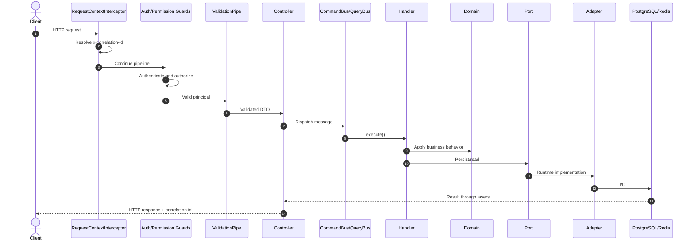
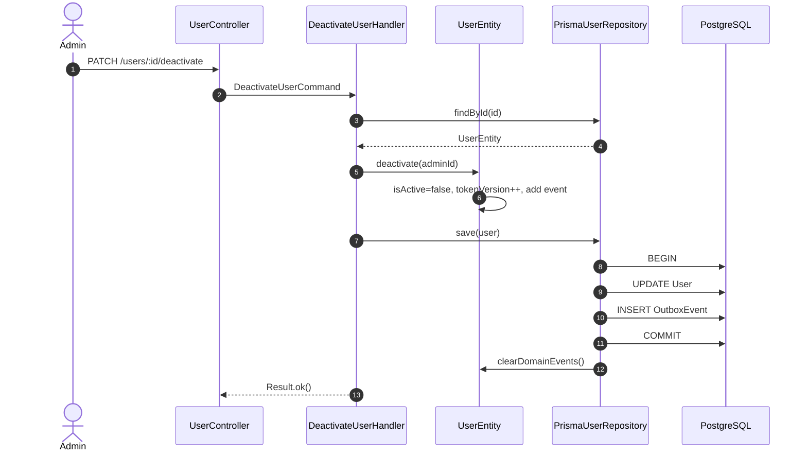

# Backend Architecture Handbook

> **Phần II · Chương 6 — Backend từ request đến side effect**
>
> Chương trước: [Kiến trúc hệ thống](../../docs/architecture.md) · [Mục lục handbook](../../docs/README.md) · Chương sau: [Admin Portal](../admin/README.md)

Nếu Chương 5 là bản đồ thành phố, chương này là chuyến đi qua từng con đường của backend. Sau khi đọc, bạn phải biết mở file nào khi một request vào hệ thống, quy tắc nghiệp vụ nằm ở đâu, đoạn ghi database kết thúc ở đâu và ai nhận những việc chạy nền như gửi email.

Đừng bắt đầu bằng cách ghi nhớ bốn tầng kiến trúc. Hãy bắt đầu bằng flow `POST /users`: controller nhận request; handler điều phối việc tạo tài khoản; `UserEntity` từ chối trạng thái không hợp lệ; repository ghi database; bảng outbox giữ lại thông báo “user vừa được tạo”; worker đọc việc nền và gửi email. Sau khi hiểu câu chuyện này, tên các tầng chỉ còn là cách gọi ngắn gọn cho từng nhóm trách nhiệm.

Tài liệu này là bản đồ kiến trúc chính thức của backend trong `apps/server`. Mục tiêu không chỉ là cho biết dự án có những thư mục nào, mà giúp một thành viên mới hiểu được hệ thống đang giải quyết vấn đề gì, vì sao code được chia như hiện tại, một request đi qua những lớp nào và phải mở rộng code theo cách nào để không phá vỡ kiến trúc.

Các README bên trong từng bounded context đi sâu vào nghiệp vụ cụ thể:

- [Auth](./src/contexts/iam/auth/README.md): đăng ký, đăng nhập, refresh token và quản lý session.
- [Users](./src/contexts/iam/users/README.md): User aggregate, trạng thái tài khoản và domain events.
- [Roles](./src/contexts/iam/roles/README.md): RBAC, role và permission.
- [Audit](./src/contexts/audit/README.md): audit trail và cơ chế ghi log xuyên suốt request.

## 1. Nên hình dung backend này như thế nào?

Backend được build và triển khai như một hệ thống duy nhất, nhưng code bên trong được chia thành những khu có trách nhiệm riêng. Kiểu tổ chức này gọi là **modular monolith**.

Mỗi khu phụ trách một nhóm nghiệp vụ: IAM quản lý danh tính và quyền; Notifications quản lý thông báo; Audit lưu dấu vết thao tác; Analytics, Menu và Storage có phạm vi riêng. Trong Domain-Driven Design, một khu có ngôn ngữ và luật riêng như vậy được gọi là **bounded context**.

“Monolith” ở đây nói về đơn vị triển khai. “Modular” nói về ranh giới trong code. Một context sở hữu model và use case của chính nó; context khác không được tùy tiện truy cập sâu vào repository hoặc entity nội bộ. Cách tổ chức này giữ chi phí vận hành thấp như monolith, đồng thời tạo ranh giới đủ rõ để hệ thống có thể phát triển lâu dài.

Bên trong mỗi context, dependency đi từ ngoài vào trong:

```text
HTTP / WebSocket / Worker
          │
          ▼
    Presentation
          │
          ▼
     Application
          │
          ▼
        Domain

Infrastructure ──implements──> Port do Domain/Application định nghĩa
```

Domain là lõi ổn định nhất. Presentation và infrastructure là chi tiết có thể thay đổi. Vì vậy domain không được biết NestJS controller, Prisma, Redis, BullMQ, Socket.IO hay HTTP status.

> **Tóm lại (chép sổ được):**
>
> - Một app deploy duy nhất, chia thành các bounded context theo nghiệp vụ.
> - Trong mỗi context: Presentation → Application → Domain; Infrastructure cắm vào port.
> - Domain không import framework — có test kiến trúc tự động canh điều này.

## 2. Các phong cách kiến trúc đang được áp dụng

### 2.1 Domain-Driven Design

DDD trong dự án thể hiện ở việc code được chia theo bounded context và hành vi nghiệp vụ được đặt trong aggregate/entity thay vì controller hoặc repository.

Ví dụ, vô hiệu hóa user không phải là câu lệnh Prisma `isActive = false` nằm trong controller. `UserEntity.deactivate()` chịu trách nhiệm đổi trạng thái, tăng `tokenVersion`, cập nhật audit fields và ghi nhận `UserDeactivatedEvent`. Nhờ vậy mọi đường gọi đều phải đi qua cùng một luật nghiệp vụ.

### 2.2 Clean/Hexagonal Architecture

Lõi hệ thống định nghĩa các port (interface mô tả việc lõi cần làm, chưa nói làm bằng công nghệ gì) như `UserRepository`, `PasswordHasher`, `ISessionStore`, `ICachePort` hoặc `AuditWriter`. Adapter kỹ thuật hiện thực các port này bằng Prisma, bcrypt hoặc Redis.

Hướng phụ thuộc là điểm quan trọng nhất:

```text
Application/Domain biết interface
Infrastructure biết interface và implementation
Interface không biết implementation
```

Nếu thay Redis bằng một session store khác, application use case không cần đổi. Nếu thay Prisma, domain entity vẫn giữ nguyên.

### 2.3 CQRS

Write use case được biểu diễn bằng Command; read use case được biểu diễn bằng Query. Nest `CommandBus` và `QueryBus` tìm handler tương ứng.

CQRS ở đây không đồng nghĩa với hai database riêng. Mục tiêu hiện tại là tách ý định:

- Command diễn tả một thay đổi trạng thái, chẳng hạn `DeactivateUserCommand`.
- Query diễn tả nhu cầu đọc, chẳng hạn `GetUsersQuery`.
- Handler là nơi điều phối các bước của use case: tải dữ liệu, gọi hành vi domain, lưu kết quả.
- Entity là nơi giữ invariant (luật nghiệp vụ luôn phải đúng) và quyết định các bước chuyển trạng thái hợp lệ.

### 2.4 Transactional Outbox

Domain event không được phát thẳng ra Redis, queue hoặc WebSocket trong transaction nghiệp vụ. Repository ghi thay đổi aggregate và bản ghi outbox trong cùng một database transaction. Một publisher độc lập sẽ đọc bảng outbox và gửi event đi sau đó.

Thiết kế này giải quyết “dual-write problem”: nếu user đã được lưu nhưng process chết trước khi enqueue email hoặc force logout, outbox vẫn còn và có thể retry.

## 3. Bản đồ codebase

```text
apps/server/
├── src/
│   ├── main.ts                    # Bootstrap HTTP application
│   ├── app.module.ts              # Composition root
│   ├── config/                    # Validate và parse environment
│   ├── contexts/                  # Các bounded context
│   │   ├── iam/
│   │   │   ├── auth/
│   │   │   ├── users/
│   │   │   └── roles/
│   │   ├── notifications/
│   │   ├── audit/
│   │   ├── analytics/
│   │   ├── menu/
│   │   └── storage/
│   ├── shared/
│   │   ├── domain/                # Domain primitives dùng chung
│   │   └── application/           # Technical application ports dùng chung
│   ├── infrastructure/            # Adapter cấp toàn application
│   ├── presentation/              # HTTP concerns dùng xuyên context
│   └── architecture/              # Test bảo vệ dependency rules
└── test/                          # E2E tests và test DB setup
```

`app.module.ts` là **composition root** (nơi duy nhất lắp ráp toàn bộ ứng dụng). Mọi module, port và adapter được ghép nối với nhau tại đây. File này được phép biết nhiều thành phần; business logic không được đặt tại đây.

Thư mục `public/uploads/` là dữ liệu runtime của `LocalStorageAdapter`, chỉ phục vụ phát triển trên máy cá nhân. Adapter tự tạo thư mục khi cần và Git bỏ qua toàn bộ file bên trong, vì ảnh người dùng không phải source code. Production không được dựa vào filesystem của container; cấu hình `STORAGE_PROVIDER=s3` để dùng S3 hoặc dịch vụ object storage tương thích S3.

## 4. Bounded context và quyền sở hữu

### IAM

IAM là nhóm context về identity và access:

- Auth sở hữu vòng đời của token (cấp, làm mới, thu hồi) và các refresh session.
- Users sở hữu User aggregate và trạng thái tài khoản.
- Roles sở hữu việc gán permission cho từng role.

Ba context liên quan chặt chẽ nhưng không nên gộp thành một folder phẳng. Auth có thể dùng `UserRepository` để xác thực, nhưng luật thay đổi User vẫn thuộc Users.

### Notifications

Notifications sở hữu notification entity, trạng thái read/unread và API lấy notification. Notification có thể được tạo từ event của context khác, nhưng context phát event không tự ghi bảng Notification.

### Audit

Audit sở hữu audit record và read API. Các context khác chỉ gắn metadata `@AuditLog`; việc ghi dữ liệu đi qua `AuditWriter`.
Retention cũng thuộc Audit context nhưng mặc định tắt: `AUDIT_RETENTION_DAYS=0`. Dự án thật chỉ bật sau khi chốt archive, legal hold và thời hạn lưu; cleanup lỗi được log nhưng không làm gián đoạn API.

### Analytics, Menu và Storage

Analytics tổng hợp dữ liệu đọc cho dashboard; `dashboard` là module/read capability bên trong nó. Menu là read capability tạo navigation tree dựa trên permission. Storage là technical capability định nghĩa port upload/delete và có adapter local/S3. Chúng không cần tạo đủ bốn layer: layer chỉ xuất hiện khi có trách nhiệm thật, còn dependency direction luôn bắt buộc.

Đọc handbook đặt cạnh code khi sửa từng capability: [Dashboard](src/contexts/analytics/dashboard/README.md), [Menu](src/contexts/menu/README.md) và [Storage](src/contexts/storage/README.md).

## 5. Một request sống từ lúc vào đến lúc trả response

Một HTTP request thông thường đi theo chuỗi sau:



### Vai trò của từng bước

`RequestContextInterceptor` lấy correlation id do client gửi hoặc sinh UUID mới. Interceptor không chỉ tạo Observable trong `AsyncLocalStorage`; nó subscribe toàn bộ RxJS request pipeline bên trong context đó, vì Nest thực hiện subscription sau khi `intercept()` trả về. Nhờ vậy handler, audit writer và outbox adapter đều đọc được cùng mã trong các tác vụ bất đồng bộ. Khi request kết thúc, interceptor ghi method, path, status, duration và user id nếu có.

Guard trả lời hai câu hỏi khác nhau:

1. Request đến từ ai?
2. Principal đó có permission cần thiết không?

Validation pipe chỉ kiểm tra dữ liệu tại HTTP boundary. Nó không thay thế domain invariant. Email có thể được kiểm tra format ở DTO để trả lỗi sớm, nhưng `Email` value object vẫn phải tự bảo vệ tính hợp lệ vì entity có thể được tạo từ worker hoặc test, không chỉ controller.

Controller chuyển HTTP input thành Command/Query và format output. Controller không chứa transaction, Prisma query hoặc business decision.

Handler điều phối các bước của use case. Handler có thể tải aggregate, gọi hành vi domain và lưu qua repository.

## 6. Một read flow hoàn chỉnh

Lấy danh sách users minh họa read path:

1. `GET /users` đi qua JWT và permission guards.
2. `GetUsersQueryDto` validate page, limit, search, sort field và sort order.
3. `UserController` dựng `GetUsersQuery` rồi gọi `QueryBus`.
4. `GetUsersQueryHandler` tính offset và gọi `UserRepository.findAll`.
5. `PrismaUserRepository` dựng `Prisma.UserWhereInput` và typed order input.
6. Repository chạy `findMany` và `count`.
7. Prisma record được map về `UserEntity`.
8. `UserPresenter` tạo response allowlist, không trả password hoặc tokenVersion.
9. Pagination presenter bổ sung metadata.

Read flow không được thay đổi domain state và không tạo domain event.

### Thử bằng tay

```bash
# Đăng nhập để lấy access token
curl -s -X POST http://localhost:3001/auth/login \
  -H "Content-Type: application/json" \
  -d '{"email":"admin@example.com","password":"<SEED_ADMIN_PASSWORD>"}'
# → {"accessToken":"eyJhbGciOi...","refreshToken":"eyJhbGciOi..."}

curl -s "http://localhost:3001/users?page=1&limit=2" \
  -H "Authorization: Bearer <accessToken>"
```

Response (rút gọn) — đối chiếu với 9 bước ở trên:

```json
{
  "data": [
    {
      "id": "0d9c1f4e-...",
      "email": "admin@example.com",
      "username": "admin",
      "avatar": null,
      "isActive": true,
      "isDeleted": false,
      "roles": ["ADMIN"],
      "createdAt": "2026-07-26T07:00:00.000Z",
      "updatedAt": "2026-07-26T07:00:00.000Z",
      "createdBy": null,
      "updatedBy": null
    }
  ],
  "meta": {
    "totalItems": 1,
    "itemCount": 1,
    "itemsPerPage": 2,
    "totalPages": 1,
    "currentPage": 1
  }
}
```

Chú ý hai điều: response **không có** `password`/`tokenVersion` (bước 8 — presenter allowlist quyết định), và `meta` do pagination presenter dựng (bước 9).

> **Tóm lại:**
>
> - Read path: Guard → DTO validate → Controller dựng Query → Handler → Repository → Presenter.
> - Presenter là allowlist: field không được liệt kê thì không bao giờ ra ngoài.
> - Query không được gây side effect nghiệp vụ.

## 7. Một write flow hoàn chỉnh

Vô hiệu hóa user minh họa write path:



Ranh giới transaction nằm trong repository, vì chỉ repository biết cách lưu aggregate và bản ghi outbox sao cho hoặc thành công cả hai, hoặc không ghi gì cả. Domain không biết transaction; controller cũng không điều khiển transaction.

### Thử bằng tay

Đăng ký một user mới rồi nhìn outbox làm việc:

```bash
curl -s -X POST http://localhost:3001/auth/register \
  -H "Content-Type: application/json" \
  -d '{"email":"hocvien@example.com","username":"hocvien","password":"matkhau123"}'
# → 201, body là user theo presenter allowlist
```

Trong ~1 giây sau đó, event đã đi hết vòng đời:

```powershell
docker exec starter-postgres psql -U postgres -d starter_db \
  -c "SELECT type, status, attempts FROM outbox_events ORDER BY occurred_at DESC LIMIT 1;"
#            type            |  status   | attempts
# --------------------------+-----------+----------
#  iam.user.registered.v1   | PUBLISHED |        1
```

Mở Maildev (`http://localhost:1083`) sẽ thấy mail chào mừng — bằng chứng event đã được route sang BullMQ worker.

> **Tóm lại:**
>
> - Write path: Controller dựng Command → Handler load aggregate → gọi method domain → Repository save.
> - Aggregate đổi state VÀ ghi event trong CÙNG một transaction — không bao giờ lệch nhau.
> - Command đặt tên theo ý định nghiệp vụ (`DeactivateUser`), không theo CRUD (`UpdateUser`).

## 8. Domain event và outbox delivery

Bốn loại message không được dùng lẫn tên hoặc interface:

| Loại              | Diễn đạt điều gì?                                                   | Nơi định nghĩa/đi tới                                             |
| ----------------- | ------------------------------------------------------------------- | ----------------------------------------------------------------- |
| Domain event      | Sự kiện đã xảy ra với aggregate trong module sở hữu nghiệp vụ.      | `domain/events`; aggregate ghi nhận, repository đưa vào outbox.   |
| Integration event | Contract ổn định cho module/context khác phản ứng sau commit.       | `@repo/contracts`; outbox router đọc type/payload đã version hóa. |
| Queue job         | Mệnh lệnh chạy một tác vụ chậm/có retry, như gửi email.             | `application/queues`; BullMQ worker consume.                      |
| Realtime event    | Payload delivery tới client đang kết nối; không phải nguồn sự thật. | `@repo/contracts/realtime`; Socket.IO emit sau processing.        |

Pipeline điển hình là `domain event → transactional outbox → integration routing → queue job/notification → realtime signal`. Domain handler không gửi email, ghi notification và emit socket trong cùng một class; mỗi bước chuyển message qua contract có ownership rõ.

Sau khi write transaction hoàn tất, `OutboxPublisherService` định kỳ quét (poll) các event đủ điều kiện gửi đi. Để nhận xử lý một event, publisher update trạng thái từ `PENDING` sang `PROCESSING` theo kiểu optimistic (update chỉ thành công nếu chưa ai nhận trước), tăng số lần thử và đặt `lockedAt`.

`OutboxEventRouter` dựng lại object event từ dữ liệu đã lưu (rehydrate), rồi chuyển đến nơi xử lý tương ứng theo type:

- `UserRegisteredEvent`: enqueue welcome email và tạo notification.
- `UserDeactivatedEvent`: revoke Redis sessions, enqueue email, tạo notification và force logout qua realtime.
- `NotificationCreatedEvent`: push notification qua Socket.IO.

Nếu gửi thành công, event chuyển sang `PUBLISHED`. Nếu thất bại, event quay về `PENDING` và lần thử lại tiếp theo bị lùi xa dần (exponential backoff). Quá số lần thử tối đa, event chuyển sang `FAILED` và nằm lại đó như một dead letter chờ người vận hành xử lý tay.

Publisher cũng tự giải cứu những event đã được nhận xử lý nhưng treo giữa chừng (claim quá hạn). Khi application tắt, timer dừng lại và lượt poll đang chạy được chờ xong trước khi pool kết nối của Prisma đóng.

Giao kiểu at-least-once (ít nhất một lần) nghĩa là consumer có thể nhận cùng một event nhiều lần. Vì vậy:

- BullMQ dùng `eventId` làm `jobId`.
- Notification do event tạo dùng deterministic id.
- Side effect mới phải được thiết kế idempotent: chạy lại lần nữa vẫn cho kết quả như chạy một lần.

> **Tóm lại:**
>
> - Vòng đời một event: `PENDING` → `PROCESSING` (claim) → `PUBLISHED`; lỗi thì quay về `PENDING` với backoff, quá ngưỡng thành `FAILED`.
> - Giao hàng kiểu at-least-once: có thể nhận trùng, nên mọi consumer phải idempotent.
> - Theo dõi outbox, queue và độ mới backup qua `GET /metrics`: `outbox_events{status}`, `outbox_oldest_pending_age_seconds`, `bullmq_jobs{queue,status}`, tuổi job chờ lâu nhất và `backup_*`. Backup gauges chỉ được đăng ký khi `BACKUP_STATUS_FILE` có cấu hình; API chỉ đọc heartbeat, không được mount hoặc đọc database dump. Production phải gửi Bearer `METRICS_TOKEN`.

## 9. Shared kernel: đặt gì và không đặt gì?

`shared/domain` chỉ chứa khái niệm domain thực sự dùng chung:

- `AggregateRoot`: gom và quản lý các domain event mà aggregate ghi nhận trong quá trình xử lý.
- `DomainEvent`: cung cấp `eventId` và `occurredOn`.
- `Result<T, E>`: cho biết use case thành công hay thất bại, kèm dữ liệu hoặc lỗi tương ứng.
- `DomainException`: base error có mã nghiệp vụ.

`shared/application/ports` chứa các interface kỹ thuật mà use case ở nhiều context cùng cần gọi tới:

- cache;
- job queue;
- realtime.

Repository contract làm việc với aggregate được phép nằm trong `domain/ports` và dùng tên `*.repository.ts`. Mọi dependency kỹ thuật mà handler gọi nằm trong `application/ports` và dùng suffix `*.port.ts`: password hasher, session/token store, storage, audit, cache, job queue và realtime. Redis, BullMQ, bcrypt, Prisma, S3 và Socket.IO là adapter trong infrastructure, không phải port và càng không nằm trong shared domain.

Trước khi đưa file vào shared, hãy hỏi: “Nếu bỏ context hiện tại đi, khái niệm này còn có ý nghĩa độc lập cho nhiều context khác không?” Nếu câu trả lời là không, file phải ở context sở hữu nó.

## 10. Authentication và token revocation

Access token chứa subject, email, permissions và `tokenVersion`. `JwtStrategy` không chỉ verify chữ ký; nó tải User hiện tại và từ chối request nếu user:

- không tồn tại;
- đã bị soft delete;
- không active;
- có token version khác payload.

Các mutation làm thay đổi quyền truy cập như update role/profile, deactivate, activate, delete hoặc restore đều tăng `tokenVersion`. Global logout cũng tăng `tokenVersion`. Do đó access token cũ mất hiệu lực ngay.

Refresh token có JTI và phải có session tương ứng trong Redis. Session key có dạng `refresh_token:{userId}:{jti}`. Mỗi lần refresh, hệ thống cấp cặp token mới và vô hiệu token cũ (rotation); logout xóa một session; global logout duyệt và xóa toàn bộ session của user bằng lệnh `SCAN` theo cursor, đồng thời tăng `tokenVersion` để access token đang lưu hành chết ngay thay vì sống nốt TTL.

> **Tóm lại:**
>
> - Access token (15 phút) chứng minh "tôi là ai + được làm gì"; refresh token (7 ngày) chỉ để xin token mới.
> - Hai cần gạt thu hồi: xóa session Redis (chặn refresh) và bump `tokenVersion` (giết access token ngay).
> - JwtStrategy luôn đối chiếu user hiện tại trong DB — không tin mù payload.

## 11. Cross-cutting concerns

### Validation và error mapping

Global `ValidationPipe` bật chế độ whitelist: field lạ bị từ chối, dữ liệu hợp lệ được chuyển thành DTO đúng kiểu. Domain/application trả `Result` hoặc ném `DomainException`; `DomainExceptionFilter` dịch các lỗi nghiệp vụ đó thành HTTP response với status phù hợp.

### Audit

Endpoint cần audit gắn `@AuditLog(action, detailsCallback)`. `AuditLogInterceptor` đọc metadata sau khi handler thành công, tạo audit entry rồi `await` `AuditWriter`. Interceptor chỉ phụ thuộc vào port `AuditWriter`; `PrismaAuditWriter` là adapter thật sự ghi bản ghi xuống database.

Không được ghi password, JWT, refresh token hoặc secret vào audit details.

### Cache

Read endpoint có thể dùng `CacheInterceptor`. Mutation dùng `CacheInvalidationInterceptor`, và việc xóa cache cũ chỉ chạy sau khi response thành công. Khi xóa cache theo pattern, hệ thống dùng Redis `SCAN` từng đợt nhỏ để không làm nghẽn server.

### Health và shutdown

- `/health/live` xác nhận process còn sống.
- `/health/ready` kiểm tra PostgreSQL và Redis.

Production managed Redis nên cung cấp một `REDIS_URL` (`redis://` hoặc `rediss://`). `src/infrastructure/cache/redis-connection.ts` là parser dùng chung cho cache, BullMQ và Socket.IO adapter, vì vậy ba consumer không thể lệch credential/TLS. Các biến host/port riêng vẫn được giữ cho local development. Pre-deploy migration và smoke test được mô tả trong [deployment contract](../../docs/provider-neutral-deployment.md).

Production image cũng chứa hai deployment entrypoint rõ ràng: `scripts/migrate.mjs` chạy migration chain và `scripts/seed.mjs` gọi seed idempotent với validation bắt buộc cho admin credential. Migration chạy như một release step riêng; seed chỉ chạy khi operator chủ động khởi tạo dữ liệu, không nằm trong startup thường xuyên của API hoặc worker.

- Nest shutdown hooks đóng resource có trật tự.

Liveness không nên kiểm tra dependency ngoài vì dependency outage không có nghĩa process cần restart. Readiness phải phản ánh application có đủ khả năng nhận traffic hay không.

## 12. Composition root và dependency injection

Các port sử dụng `Symbol` làm DI token, chẳng hạn `USER_REPOSITORY`, `CACHE_PORT` và `AUDIT_WRITER`. Module chịu trách nhiệm bind token với implementation.

Ví dụ:

```text
UserRepository port ──bound to──> PrismaUserRepository
PasswordHasher port ──bound to──> BcryptPasswordHasher
ISessionStore port  ──bound to──> RedisSessionStore
AuditWriter port    ──bound to──> PrismaAuditWriter
```

Không inject concrete adapter vào handler nếu đã có port. Concrete class chỉ nên xuất hiện ở chỗ module đấu nối dependency (wiring) hoặc trong code infrastructure.

## 13. Quy tắc phụ thuộc bắt buộc

### Domain được phép

- TypeScript và domain code cùng context.
- Shared domain primitives.
- Contract thuần không mang framework/runtime.

### Domain không được phép

- NestJS decorators/service.
- Prisma types/client.
- Redis, BullMQ, Socket.IO.
- Controller DTO.
- Adapter của context khác.

### Application được phép

- Domain của context.
- Port do domain/application định nghĩa.
- CQRS message/handler primitives.

### Presentation và infrastructure

Presentation được gọi application nhưng không gọi thẳng Prisma. Infrastructure được hiện thực port và phụ thuộc library kỹ thuật, nhưng không quyết định business rule.

`src/architecture/dependency-rules.spec.ts` là bộ test đóng vai trò "tài liệu chạy được": nó tự động canh giữ các hướng phụ thuộc quan trọng.

## 14. Cách thêm một use case mới

Giả sử cần thêm “restore user”:

1. Xác định các invariant cần giữ và viết bước chuyển trạng thái trong `UserEntity.restore()`.
2. Xác định mutation có cần tăng tokenVersion hoặc phát event không.
3. Tạo `RestoreUserCommand` diễn tả input của use case.
4. Tạo handler: tải user, gọi entity, lưu qua `UserRepository`.
5. Chỉ mở rộng repository port nếu use case thật sự cần capability mới.
6. Tạo DTO runtime validation và endpoint.
7. Gắn permission, audit và cache invalidation phù hợp.
8. Viết unit test cho domain transition và handler.
9. Viết E2E cho authentication, authorization, persistence và side effect quan trọng.
10. Cập nhật README của Users nếu flow hoặc invariant thay đổi.

Đối với query mới, không được đổi trạng thái dữ liệu và không phát domain event. Query handler nên trả một contract rõ ràng, tránh `any`.

## 15. Anti-pattern cần tránh

### Business logic trong controller

Sai: controller tự đổi `isActive`, tự tăng token version và gọi Prisma.

Đúng: controller chỉ gửi command; entity quyết định việc chuyển trạng thái; repository lo việc lưu xuống database.

### Domain event chứa delivery instruction

Sai: event có `queueName`, `cachePattern` hoặc Socket.IO room.

Đúng: event chỉ mô tả sự việc nghiệp vụ đã xảy ra; router ở tầng infrastructure mới quyết định gửi event đi đâu.

### Ghi aggregate rồi enqueue riêng lẻ

Sai: `await repository.save(); await queue.add();`.

Đúng: ghi aggregate và outbox trong cùng một transaction, gửi event đi sau khi commit.

### `shared` thành thư mục tiện ích

Không đưa code vào shared chỉ vì hai file đang import nó. Shared phải có ý nghĩa kiến trúc ổn định và ownership rõ ràng.

### Promise fire-and-forget

Side effect quan trọng phải được await hoặc đưa vào queue/outbox có retry. `tap(async () => ...)` tạo ra một promise trôi nổi mà observable không theo dõi — không ai chờ, không ai bắt lỗi — nên không được dùng cho việc ghi dữ liệu quan trọng.

## 16. Testing và quality gates

Các lớp kiểm thử có mục đích khác nhau:

- Domain unit test bảo vệ invariant và state transition.
- Application/infrastructure unit test bảo vệ mapper, router, retry và error handling.
- Architecture test bảo vệ dependency direction.
- E2E test dùng PostgreSQL/Redis/BullMQ thật để kiểm tra flow xuyên lớp.

Test database chỉ được reset nếu tên kết thúc bằng `_test`. Global setup dùng Prisma `db push --force-reset` và seed dữ liệu chuẩn.

Quality gate:

```bash
pnpm --filter=server verify
pnpm --filter=server test:e2e
```

`verify` chạy lint, build, typecheck và unit tests. E2E chạy riêng vì cần infrastructure local.

Global setup của E2E chỉ reset database có tên kết thúc bằng `_test`, sau đó gọi Prisma và seed qua scripts của `@repo/database`. Không gọi `npx tsx` từ thư mục Server: `tsx` là dependency của database package, và chạy executable theo current working directory có thể pass trên một máy nhưng fail trên CI hoặc pnpm layout khác.

## 17. Lộ trình đọc code cho thành viên mới

Đọc theo một flow thay vì đọc alphabet:

1. `src/main.ts` và `src/app.module.ts` để hiểu ứng dụng khởi động và được lắp ráp thế nào.
2. `src/shared/domain/aggregate-root.ts`, `result.ts` và `events/domain-event.ts`.
3. README Users, sau đó lần theo `UserController → Command → Handler → UserEntity → Repository`.
4. `PrismaUserRepository.save()` để hiểu transaction + outbox.
5. `OutboxPublisherService` và `OutboxEventRouter`.
6. README Auth và hai JWT strategies.
7. README Roles và `PermissionsGuard`.
8. README Audit và global interceptors.
9. E2E test để thấy các flow được chứng minh ở runtime.

## 18. Checklist review kiến trúc

Trước khi merge một thay đổi backend, reviewer nên trả lời được:

- Context nào sở hữu nghiệp vụ này?
- Business invariant nằm trong domain hay đang rò ra controller/repository?
- Hướng dependency có đi từ ngoài vào trong?
- Handler phụ thuộc port hay concrete adapter?
- Thay đổi aggregate và event có được ghi trong cùng một transaction không?
- Side effect có retry/idempotency không?
- Mutation có ảnh hưởng tokenVersion, audit hoặc cache không?
- DTO có runtime validation và reject field lạ không?
- Response có vô tình lộ password, token hoặc internal field không?
- Có unit/E2E test đúng cấp độ không?
- Tài liệu context đã phản ánh flow mới chưa?

Nếu giữ đúng các nguyên tắc này, backend có thể tiếp tục là nền tảng cho nhiều dự án mà không biến thành một monolith khó kiểm soát.
