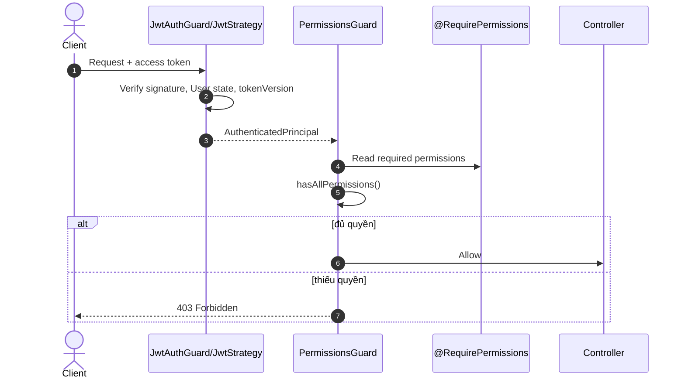

# Roles Bounded Context

> **Phần III · Chương 11 — Vai trò, quyền và quyết định truy cập**
>
> Chương trước: [Users context](../users/README.md) · [Mục lục handbook](../../../../../../docs/README.md) · Chương sau: [Notifications context](../../notifications/README.md)

Roles trả lời “người đã đăng nhập có được làm việc này không?”. Nếu hệ thống chưa xác định được người gọi là ai, API trả `401`. Nếu đã biết họ là ai nhưng họ thiếu quyền, API trả `403`. Hai trường hợp này lần lượt gọi là **authentication** và **authorization**.

Ta sẽ đi theo request đọc danh sách role. Một lớp kiểm tra đứng trước controller xác minh token. Lớp kế tiếp đọc quyền mà endpoint yêu cầu và so với quyền của user. Trong NestJS, lớp đứng chặn request như vậy gọi là **guard**. UI có thể ẩn nút để dễ dùng hơn, nhưng backend luôn là nơi quyết định cuối cùng.

Roles sở hữu mô hình RBAC: role, danh mục permission và quan hệ role-permission. Context này trả lời “một role đại diện cho tập quyền nào?”. Còn việc kiểm tra một HTTP request có đủ quyền hay không diễn ra ở guard thuộc tầng presentation.

> Gặp từ lạ (RBAC, guard, aggregate, tokenVersion…)? Tra [Bảng thuật ngữ](../../../../../../docs/glossary.md).

## 1. Khái niệm nghiệp vụ

Permission là một quyền nhỏ, ổn định, dùng chung qua `@repo/contracts` — ví dụ quyền đọc user hoặc quyền cập nhật user. Role là một nhóm permission có tên và mô tả. User nhận permission bằng cách được gán role.

Luồng khái niệm:

```text
User ──has──> Role ──contains──> Permission
                         │
JWT access token <──── resolved permissions
```

Frontend và backend dùng chung một bộ tên permission để hai bên không lệch nhau. Tuy nhiên chặn hay cho qua một request luôn do backend quyết định cuối cùng.

## 2. Roles chịu trách nhiệm gì?

Roles sở hữu:

- Role aggregate;
- port repository của role;
- các use case tạo role, xóa role và cập nhật tập permission của role;
- query đọc danh sách role và danh mục permission;
- phần ánh xạ Prisma cho các bảng Role/Permission/RolePermission.

Roles không sở hữu việc gán/bỏ role cho user (bảng UserRole) — phần đó thuộc User aggregate. Khi admin đổi role của một user, Users context xử lý và tăng tokenVersion.

## 3. Cấu trúc code

```text
roles/
├── domain/
│   ├── role.entity.ts
│   ├── exceptions/
│   └── ports/role.repository.ts
├── application/
│   ├── commands/ + handlers/
│   └── queries/ + handlers/
├── infrastructure/
│   └── repositories/prisma-role.repository.ts
├── presentation/
│   ├── controllers/roles.controller.ts
│   └── dtos/
└── roles.module.ts
```

## 4. Authorization request flow



Bước kiểm tra permission chỉ đọc danh sách quyền ghi sẵn trong token — tin được, vì strategy vừa xác nhận ngay trước đó rằng token vẫn thuộc phiên bản quyền hiện tại của user. Vì đổi role của user làm tokenVersion tăng, token còn mang permission cũ sẽ bị loại từ bước xác thực.

Không xác định được người gọi là ai thì trả 401; biết là ai nhưng thiếu quyền thì trả 403. Hai trường hợp không được trộn lẫn.

### Thử bằng tay: phân biệt 401 và 403

```bash
# Không có token → 401: "bạn là ai tôi còn chưa biết"
curl -s -o /dev/null -w "%{http_code}\n" http://localhost:3001/roles
# → 401

# Token hợp lệ nhưng user KHÔNG có ROLE.READ → 403: "biết bạn là ai, nhưng không được phép"
# (đăng nhập bằng một user thường chỉ có role USER)
curl -s -o /dev/null -w "%{http_code}\n" http://localhost:3001/roles \
  -H "Authorization: Bearer <token của user thường>"
# → 403

# Token admin → 200 kèm danh sách role và permission
curl -s http://localhost:3001/roles -H "Authorization: Bearer <admin token>"
```

> **Tóm lại:**
>
> - Hai cổng nối tiếp: JwtAuthGuard trả lời "bạn là ai?" (sai → 401), PermissionsGuard trả lời "bạn được làm gì?" (thiếu → 403).
> - Permission check đọc claim trong token — tin được vì JwtStrategy đã đối chiếu `tokenVersion` với DB ngay trước đó.
> - Đổi role assignment của user ⇒ tokenVersion tăng ⇒ token cũ mang permission cũ bị loại ngay.

## 5. Create role flow

1. DTO validate name/description.
2. `PermissionsGuard` yêu cầu `ROLE.CREATE`.
3. Controller dựng `CreateRoleCommand`.
4. Handler kiểm tra role name đã tồn tại.
5. Handler tạo `RoleEntity`.
6. Repository lưu role và mapping cần thiết.
7. Audit interceptor ghi actor/action sau thành công.

Tạo role trùng tên phải trả về domain error có mã lỗi rõ ràng, không để lỗi unique constraint của Prisma văng thẳng ra HTTP.

## 6. Update permissions flow

`PUT /roles/:id/permissions` nhận một mảng string và coi nó là toàn bộ trạng thái đích: sau request, role phải có đúng tập permission này. Đây là thao tác **replace**, không phải danh sách thêm/bớt.

Handler bỏ giá trị trùng rồi đối chiếu toàn bộ tên với permission catalog. Chỉ cần một tên không tồn tại, cả thao tác thất bại với `INVALID_ROLE_PERMISSIONS` (HTTP 400); mapping cũ được giữ nguyên. Vì vậy lỗi chính tả không thể bị bỏ qua trong im lặng.

Khi tập permission thực sự thay đổi, `replacePermissionsAndRevokeAffectedUsers()` thực hiện trong một transaction:

1. cập nhật metadata của role;
2. thay bảng nối `RolePermission`;
3. tăng `tokenVersion` của mọi user đang mang role đó.

Nếu một bước thất bại, cả ba rollback. Access token cũ đang chứa permission cũ bị từ chối ngay ở request kế tiếp; refresh session vẫn có thể cấp token mới từ permission hiện tại. Gửi lại cùng một tập permission, kể cả khác thứ tự, không ghi lại bảng nối và không revoke token.

> **Tóm lại:**
>
> - API thành công nghĩa là toàn bộ permission gửi lên đều tồn tại và đã trở thành trạng thái đích.
> - Thay đổi nội dung role và thu hồi access token liên quan là cùng một transaction, không có khoảng thời gian mapping mới nhưng token cũ vẫn hợp lệ.

## 7. Delete semantics

Xóa role đi qua command/repository như một thao tác nghiệp vụ và chỉ đánh dấu xóa mềm (soft-delete), không xóa hẳn khỏi database. `ADMIN` và `USER` là hai system role được khai báo tập trung trong `@repo/contracts`; delete handler từ chối chúng bằng `SYSTEM_ROLE_DELETE_FORBIDDEN`. UI ẩn nút xóa để có trải nghiệm đúng, nhưng invariant thực sự nằm ở backend nên gọi thẳng API cũng không thể vượt qua.

Custom role chỉ được xóa khi không còn gán cho user nào. Handler gọi `countAssignedUsers()` trước khi xóa; nếu còn assignment, API trả `ROLE_IN_USE` (HTTP 409) cùng tên role và số user liên quan. Admin phải chuyển các user sang role khác trước, vì hệ thống không được tự đoán role thay thế.

Repository đọc permission của user cũng lọc role đã soft-delete như lớp phòng vệ thứ hai. Tuy vậy, luồng chuẩn vẫn là chặn xóa role đang dùng; không dựa vào bộ lọc này để âm thầm làm user mất quyền.

## 8. API surface

| Endpoint                     | Permission    | Mục đích              |
| ---------------------------- | ------------- | --------------------- |
| `GET /roles`                 | `ROLE.READ`   | Roles kèm permissions |
| `GET /roles/permissions`     | `ROLE.READ`   | Permission catalog    |
| `POST /roles`                | `ROLE.CREATE` | Tạo role              |
| `PUT /roles/:id/permissions` | `ROLE.UPDATE` | Thay tập permission   |
| `DELETE /roles/:id`          | `ROLE.DELETE` | Xóa role              |

## 9. Ý nghĩa từng nhóm file

`role.entity.ts` giữ dữ liệu và hành vi của role. Thư mục exceptions đặt tên cho từng kiểu thất bại (“role trùng tên”, “role không tồn tại”) dưới dạng domain error. `role.repository.ts` là interface lưu/đọc role, đồng thời là token để NestJS biết tiêm implementation nào vào.

Các file command/query mô tả use case; handler làm việc thật: tải entity qua repository, gọi hành vi của entity, lưu kết quả. `prisma-role.repository.ts` dịch qua lại giữa aggregate và ba bảng Role, Permission, RolePermission.

DTO kiểm tra input lúc chạy; controller chỉ nhận request, gắn guard/audit, gửi command/query vào bus rồi trả response.

## 10. Shared permission contracts

Các hằng số permission và hàm hỗ trợ như `hasAllPermissions` nằm trong `@repo/contracts`, vì nhiều ứng dụng (server, web) cần nói cùng một ngôn ngữ về quyền.

Khi thêm permission:

1. khai báo tên permission trong contracts;
2. cập nhật dữ liệu seed và danh mục trong database;
3. gắn permission vào role phù hợp;
4. dùng hằng số trong decorator, không viết chuỗi tay;
5. cập nhật admin UI nếu cần;
6. test cả trường hợp được phép lẫn bị từ chối.

## 11. Những quy tắc luôn phải đúng

- Tên role không được trùng; quy tắc này do domain/repository giữ.
- Chỉ permission có trong danh mục mới được lưu; một tên lạ làm toàn bộ replace thất bại.
- Controller không được tự sửa bảng nối RolePermission.
- Không viết chuỗi tên role/permission rải rác trong code; luôn dùng hằng số từ contracts.
- Backend không tin việc UI đã ẩn nút; guard luôn chặn ở phía server.
- Đổi tập permission phải tăng tokenVersion của mọi user mang role trong cùng transaction.
- Role đang gán cho user không được xóa; admin phải gỡ hoặc chuyển assignment trước.

## 12. Anti-pattern

- Kiểm tra quyền bằng tên role (“nếu là ADMIN thì cho qua”) thay vì bằng permission.
- Tự query bảng permission trong từng controller.
- Chấp nhận chuỗi permission tùy ý rồi âm thầm bỏ qua giá trị sai.
- Sửa bảng nối RolePermission ở nơi khác ngoài repository.
- Xóa role hệ thống mà không có quy tắc chặn.
- Cập nhật RolePermission và tokenVersion bằng hai transaction tách rời.

## 13. Checklist review Roles

- Permission mới đã được khai báo trong contracts và seed chưa?
- Endpoint có dùng đúng hằng số permission không?
- Lỗi 401 và 403 có được trả đúng trường hợp không?
- Thay đổi role có kèm chính sách xử lý user/token liên quan không?
- Repository có cập nhật bảng nối đúng theo trạng thái đích không?
- Có test các ca cho phép, từ chối, trùng tên và role không tồn tại không?
