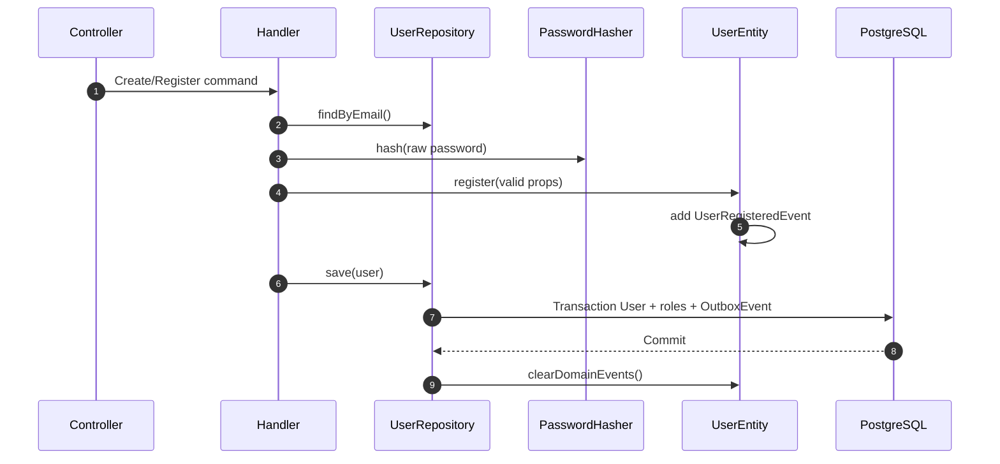
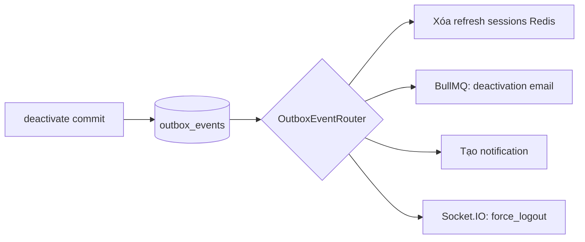

# Users Bounded Context

> **Phần III · Chương 10 — Vòng đời một tài khoản**
>
> Chương trước: [Auth context](../auth/README.md) · [Mục lục handbook](../../../../../../docs/README.md) · Chương sau: [Roles context](../roles/README.md)

Users sở hữu trạng thái và quy tắc vòng đời của tài khoản: tạo, cập nhật, kích hoạt, vô hiệu hóa và xóa. Auth có thể đọc user để xác thực, nhưng không được tự thay đổi quy tắc vòng đời này.

Câu chuyện chính là admin tạo một nhân viên mới. Hệ thống phải kiểm tra email, lưu tài khoản và ghi lại sự kiện “user vừa được tạo” trong cùng một lần ghi database. Nếu một phần thất bại, cả hai phần đều không được lưu.

Email chào mừng được gửi sau đó bởi worker. Gửi mail chậm hoặc lỗi không được phép làm mất tài khoản vừa tạo. Những việc xảy ra bên ngoài lần ghi dữ liệu chính như gửi mail được gọi là **side effect**.

`UserEntity` gom trạng thái của tài khoản và các hành động được phép lên trạng thái đó. Một cụm dữ liệu được thay đổi như một khối như vậy gọi là **aggregate**. Những luật luôn phải đúng, ví dụ “user đã xóa không thể được kích hoạt lại tùy tiện”, gọi là **invariant**.

> Gặp từ lạ (aggregate, port, invariant, outbox…)? Tra [Bảng thuật ngữ](../../../../../../docs/glossary.md) — mỗi khái niệm có định nghĩa một câu kèm ví dụ trong repo.

## 1. Users chịu trách nhiệm gì?

Users sở hữu:

- User entity và các value object;
- các use case tạo, cập nhật, vô hiệu hóa, xóa và bật/tắt trạng thái user;
- việc lưu và đọc bảng User và UserRole;
- port băm mật khẩu (`PasswordHasher`);
- các domain event mô tả thay đổi User.

Users không ký token, cũng không quản lý phiên refresh; đó là việc của Auth. Users cũng không tự gửi email, tạo notification hay đẩy tin qua Socket.IO. Nó chỉ ghi lại chuyện gì vừa xảy ra dưới dạng domain event; sau đó hạ tầng outbox đọc các event này và chia việc cho từng nơi xử lý side effect.

## 2. Aggregate model

`UserEntity` là aggregate root. State chính gồm identity, email, username, password hash, avatar, roles, active/deleted flags, tokenVersion và audit timestamps.

Aggregate bảo vệ state transition:

- `register()` tạo user mới active, chưa deleted, version bằng 0 và phát `UserRegisteredEvent`.
- `emailVerifiedAt` cho biết địa chỉ hiện tại đã được chứng minh quyền sở hữu hay chưa. Đổi email luôn xóa mốc này; Auth quyết định khi nào policy bắt buộc xác minh và là nơi consume verification token.
- `updateInfo()` thay email/username/avatar và cập nhật audit fields, nhưng không thu hồi access token vì các field profile không thay đổi quyền truy cập.
- `updateRoles()` chuẩn hóa role trùng và chỉ tăng tokenVersion khi tập role thực sự thay đổi. Gửi lại cùng các role theo thứ tự khác không làm token cũ mất hiệu lực.
- `deactivate()` tắt truy cập, tăng tokenVersion và phát `UserDeactivatedEvent`.
- `activate()`, `softDelete()` và `restore()` thay trạng thái và làm token cũ hết hiệu lực bằng cách tăng tokenVersion.

Application layer còn bảo vệ một quy tắc liên quan đến người thực hiện thao tác: admin không được tự vô hiệu hóa, tự đổi trạng thái active hoặc tự xóa chính tài khoản đang đăng nhập. Ba command handler kiểm tra `target user id === adminId` trước khi đọc hay ghi repository và trả `USER_SELF_MUTATION_FORBIDDEN` (HTTP 409). Quy tắc phải nằm ở backend vì client, script hoặc công cụ API đều có thể gọi endpoint mà không đi qua giao diện Admin.

tokenVersion thuộc aggregate vì nó là số phiên bản của quyền truy cập user — quyền đổi thì số tăng — chứ không phải một chi tiết kỹ thuật của JWT.

> **Tóm lại:**
>
> - Mọi thay đổi trạng thái User đi qua method của `UserEntity` — không ai sửa field trực tiếp.
> - Quy tắc nhớ nhanh: thay đổi nào ảnh hưởng QUYỀN TRUY CẬP thì tăng `tokenVersion`; thay đổi nào là SỰ KIỆN NGHIỆP VỤ đáng để hệ thống phản ứng thì phát domain event.
> - `register()` và `deactivate()` làm cả hai: đổi state và phát event.

## 3. Value objects

`UserId`, `Email`, `Username` và `Password` đảm bảo dữ liệu không hợp lệ không thể âm thầm đi vào aggregate. DTO kiểm tra input để trả lỗi HTTP sớm; còn value object là chốt chặn cuối cùng — dữ liệu đi vào từ đường nào (HTTP, seed, test) thì giá trị sai vẫn bị chặn trước khi chạm vào domain.

Password value object giữ hash, không giữ mật khẩu thô. Mật khẩu thô chỉ sống rất ngắn: đi vào theo command, được `PasswordHasher` băm ngay, rồi không còn được giữ ở đâu nữa.

## 4. Cấu trúc code

```text
users/
├── domain/
│   ├── user.entity.ts
│   ├── value-objects/
│   ├── events/
│   ├── exceptions/
│   └── ports/
│       ├── user.repository.ts
│       └── password-hasher.ts
├── application/
│   ├── commands/ + handlers/
│   ├── queries/ + handlers/
│   └── queues/
├── infrastructure/
│   ├── repositories/prisma-user.repository.ts
│   ├── mappers/prisma-user.mapper.ts
│   └── services/bcrypt-password-hasher.ts
├── presentation/
│   ├── controllers/
│   ├── dtos/
│   └── presenters/
└── users.module.ts
```

## 5. Create user flow

Admin tạo user và người dùng tự đăng ký là hai command đi vào từ hai cửa khác nhau, nhưng cuối cùng đều phải tạo User aggregate qua cùng một bộ quy tắc.



Nếu email đã tồn tại, handler trả domain error trước khi hash/save. Nếu transaction thất bại, cả User lẫn outbox đều rollback.

## 6. Deactivation và side effects

Khi admin vô hiệu hóa tài khoản, entity chỉ đổi trạng thái và ghi lại event. Sau khi transaction commit, outbox router lần lượt:

1. xóa các phiên refresh trong Redis qua cache port;
2. đẩy job gửi email deactivation vào queue, lấy eventId làm jobId;
3. tạo notification với id tính trước được (deterministic — chạy lại vẫn ra đúng id đó, không sinh bản ghi trùng);
4. đẩy sự kiện `force_logout` qua kênh realtime.

Side effect không đặt trong entity hay handler, vì chúng thất bại và được thử lại theo nhịp riêng, khác với database transaction vốn commit một lần là xong.



### Thử bằng tay

Chuỗi lệnh sau cho thấy toàn bộ chương này chạy thật (cần token admin — xem cách lấy ở [handbook backend §6](../../../../README.md)):

```bash
# 1. Tạo một user thí nghiệm rồi đăng nhập bằng chính nó
curl -s -X POST http://localhost:3001/auth/register \
  -H "Content-Type: application/json" \
  -d '{"email":"victim@example.com","username":"victim","password":"matkhau123"}'
# → ghi lại "id" trong response

curl -s -X POST http://localhost:3001/auth/login \
  -H "Content-Type: application/json" \
  -d '{"email":"victim@example.com","password":"matkhau123"}'
# → giữ accessToken của victim (gọi là V)

# 2. Dùng token admin deactivate user đó
curl -s -X PATCH http://localhost:3001/users/<id>/deactivate \
  -H "Authorization: Bearer <admin accessToken>"

# 3. Token V chết NGAY LẬP TỨC dù còn hạn 15 phút — vì tokenVersion đã tăng
curl -s http://localhost:3001/users/me -H "Authorization: Bearer <V>"
# → 401 "Access token has been revoked"
```

Ba dấu vết hậu trường để đối chiếu với diagram: row `iam.user.deactivated.v1` trong `outbox_events` chuyển `PUBLISHED`; mail deactivation hiện trong Maildev (`http://localhost:1083`); và key `refresh_token:<id>:*` biến mất khỏi Redis.

## 7. Dữ liệu được lưu trong một transaction như thế nào?

`PrismaUserRepository` hiện thực `UserRepository`. Mapper chuyển bản ghi Prisma thành aggregate; `toPrimitives()` chuyển aggregate ngược lại thành dữ liệu thuần có kiểu rõ ràng để lưu xuống database.

`save()` thực hiện trong một transaction:

- upsert User;
- đồng bộ UserRole join records;
- insert mọi domain event vào OutboxEvent.

Domain events chỉ được clear sau commit. Nếu clear trước commit và transaction thất bại, retry sẽ mất event.

Repository không tự quyết định chuyện chuyển trạng thái nghiệp vụ. Nó chỉ lưu xuống trạng thái mà aggregate đã xác nhận là hợp lệ.

### Vì sao không được làm mất administrator cuối cùng?

Một hệ thống không còn tài khoản `ADMIN` đang hoạt động sẽ không thể tự quản trị qua giao diện. Tình huống này có thể xảy ra theo bốn đường khác nhau: bỏ role `ADMIN` khi sửa user, deactivate user, chuyển trạng thái sang inactive hoặc soft-delete user.

Các command trên đều lưu qua `savePreservingLastAdministrator()`. Repository chỉ áp dụng guard khi user trong database hiện là một `ADMIN` đang hoạt động nhưng trạng thái mới không còn thỏa điều kiện đó. Trong transaction, repository lấy PostgreSQL advisory lock dùng chung, đếm số administrator đang hoạt động rồi mới ghi. Nếu chỉ còn một người, transaction không thay đổi User, UserRole hay OutboxEvent và handler trả lỗi `LAST_ADMINISTRATOR_REQUIRED` (HTTP 409).

Lock là phần bắt buộc của invariant, không phải tối ưu hiệu năng. Nếu hai request cùng đọc “còn 2 admin” rồi đồng thời vô hiệu hóa mỗi người, một phép đếm thông thường có thể cho cả hai đi qua và kết quả vẫn là 0 admin. Advisory lock buộc các thao tác có khả năng loại admin chạy lần lượt, nên request thứ hai sẽ nhìn thấy dữ liệu đã commit của request thứ nhất và bị từ chối.

### Role assignment được kiểm tra trước khi ghi

Create và update user đều coi mảng `roles` là toàn bộ tập vai trò cần gán. Mảng phải có ít nhất một phần tử và mọi tên role phải tồn tại, chưa bị xóa. Handler loại tên trùng, tải các tên đang tồn tại rồi so sánh toàn bộ tập trước khi hash password hoặc thay đổi aggregate. Nếu mảng rỗng hoặc có tên lạ, cả command bị từ chối bằng `INVALID_USER_ROLES` (HTTP 400); repository không được phép âm thầm bỏ tên sai và lưu phần còn lại.

Quy tắc “từ chối toàn bộ” giữ response, aggregate và các row `UserRole` nhất quán. Ví dụ `["USER", "MISSING"]` không được biến thành `["USER"]`, vì người gọi sẽ tưởng cả hai assignment đã thành công.

## 8. Read flow và response safety

`GetUsersQuery` hỗ trợ phân trang, tìm kiếm, và chỉ cho sắp xếp theo một danh sách cột định sẵn (allowlist). DTO không cho client truyền tên cột tùy ý. Repository dùng kiểu input có sẵn của Prisma thay vì `any`.

`UserPresenter` là danh sách field được phép trả ra ngoài: field nào không có tên trong đó thì không bao giờ xuất hiện trong response. Nó trả các field profile/trạng thái/roles/audit cần thiết, nhưng không trả:

- password hash;
- tokenVersion;

Password reset đi qua `UserRepository.changePassword()`, một credential write hẹp chỉ cập nhật password hash và tăng `tokenVersion` bằng cùng một câu lệnh database. Nó không gọi `save()` với snapshot aggregate cũ, vì việc đồng bộ lại toàn bộ roles trong lúc một admin cũng đang sửa quyền có thể làm mất cập nhật mới hơn.

- domain event nội bộ;
- persistence join records.

`GET /users/me` được cache theo user id. Khi một command ghi thành công, cache của user đó bị xóa để lần đọc sau lấy dữ liệu mới.

> **Tóm lại:**
>
> - Ghi: một transaction duy nhất gồm User + UserRole + OutboxEvent — event chỉ được clear SAU commit.
> - Đọc: sort/search qua allowlist trong DTO; presenter quyết định field nào được ra ngoài.
> - Hai thứ không bao giờ xuất hiện trong response: `password` hash và `tokenVersion`.

## 9. API surface

| Endpoint                      | Permission    | Hành vi               |
| ----------------------------- | ------------- | --------------------- |
| `GET /users/me`               | Authenticated | Profile hiện tại      |
| `GET /users`                  | `USER.READ`   | Danh sách users       |
| `POST /users`                 | `USER.CREATE` | Admin tạo user        |
| `PUT /users/:id`              | `USER.UPDATE` | Update profile/roles  |
| `PATCH /users/:id/activate`   | `USER.UPDATE` | Kích hoạt tài khoản   |
| `PATCH /users/:id/deactivate` | `USER.UPDATE` | Vô hiệu hóa tài khoản |
| `PATCH /users/:id/deactivate` | `USER.UPDATE` | Deactivate rõ nghĩa   |
| `DELETE /users/:id`           | `USER.DELETE` | Soft delete           |

Controller chỉ gắn guard, khai báo permission, audit và cache metadata. Mọi thay đổi dữ liệu nghiệp vụ phải đi qua command handler.

## 10. Queue worker

`user-queue.processor.ts` là BullMQ consumer gửi welcome/deactivation email. Worker nhận typed job data và trả typed result.

Processor này KHÔNG chạy trong API process. Nó được lắp vào `src/worker.module.ts` và chạy như một process riêng (`pnpm --filter=server dev:worker` khi phát triển, `node dist/worker.js` ở production) — API chỉ đẩy job vào queue, việc gửi mail chậm bao nhiêu cũng không ảnh hưởng thời gian trả lời HTTP.

Worker nằm ở tầng application nhưng job được đưa vào queue từ outbox router. Vì outbox đảm bảo “gửi ít nhất một lần” (at-least-once) — nghĩa là một event có thể được gửi lặp — job phải idempotent (chạy lại lần nữa kết quả vẫn như cũ) hoặc dùng jobId tính trước được để queue tự bỏ qua lần gửi trùng.

Gửi mail thất bại không làm rollback transaction User, vì transaction đã commit từ trước. Việc thử gửi lại do BullMQ đảm nhiệm theo chính sách retry của queue.

## 11. Ý nghĩa từng nhóm file

`domain/user.entity.ts` là nguồn sự thật về chuyển trạng thái: muốn biết user được đổi từ trạng thái nào sang trạng thái nào, đọc file này. `domain/events` chỉ ghi nhận chuyện đã xảy ra (“user X vừa bị vô hiệu hóa”), không chứa cách xử lý. `domain/ports` khai báo những việc domain cần bên ngoài làm giúp: lưu/đọc user, băm mật khẩu.

Commands/queries ở tầng application mô tả từng use case. Handler ghép các mảnh lại: tải aggregate qua port, gọi method của entity, lưu kết quả. `application/queues` chứa worker nhận job chạy nền.

Ở tầng infrastructure, mapper dịch qua lại giữa bản ghi Prisma và aggregate, repository lưu/đọc database, service băm mật khẩu bằng bcrypt.

Ở tầng presentation, DTO chặn input sai, controller nhận request rồi gửi command/query, presenter lọc field nào được phép trả ra ngoài.

## 12. Những quy tắc luôn phải đúng

- Email và username phải hợp lệ trước khi entity được tạo ra.
- Mật khẩu thô không bao giờ được lưu xuống database hay ghi ra log.
- Thay đổi nào ảnh hưởng quyền truy cập phải tăng tokenVersion.
- User đã xóa hoặc bị khóa không được đăng nhập.
- Thay đổi User và domain event phải được commit chung một transaction — hoặc cả hai cùng vào, hoặc cả hai cùng không.
- Chỉ được gán role thực sự tồn tại.
- Response không được lộ password hash/tokenVersion.

## 13. Cách thêm mutation mới

Ví dụ thêm restore endpoint:

1. xác nhận `UserEntity.restore()` thể hiện đủ invariant;
2. thêm command và handler;
3. handler tải aggregate và gọi method của entity;
4. save qua repository để domain event vẫn được ghi vào outbox trong cùng transaction;
5. thêm DTO/route/permission/audit/cache metadata;
6. unit test cho tokenVersion và bước chuyển trạng thái;
7. test E2E kiểm tra phân quyền và việc token cũ bị từ chối;
8. cập nhật tài liệu nếu có event/side effect mới.

Không được thêm `prisma.user.update()` trực tiếp trong controller hoặc handler chỉ vì mutation nhỏ.

## 14. Anti-pattern

- Entity rỗng ruột (anemic) chỉ chứa getter/setter, còn logic nằm rải rác chỗ khác.
- Controller tự quyết định trạng thái active/deleted thay vì để aggregate quyết.
- Repository tự tăng tokenVersion mà domain không biết.
- Domain event tự gọi Redis/queue/realtime (event chỉ mô tả, không hành động).
- Xóa danh sách event trước khi transaction commit.
- Cột sắp xếp nhận chuỗi tùy ý từ client.
- Presenter trả nguyên toàn bộ `toPrimitives()` ra ngoài.

## 15. Checklist review Users

- Bước chuyển trạng thái có nằm trong aggregate không?
- Thay đổi này có cần thu hồi token hoặc phát domain event không?
- Repository có gói User + roles + outbox trong một transaction không?
- Side effect có chạy lại an toàn (idempotent) và có cơ chế retry không?
- DTO và presenter có danh sách field cho phép rõ ràng không?
- Unit test có kiểm tra invariant, tokenVersion và event không?
