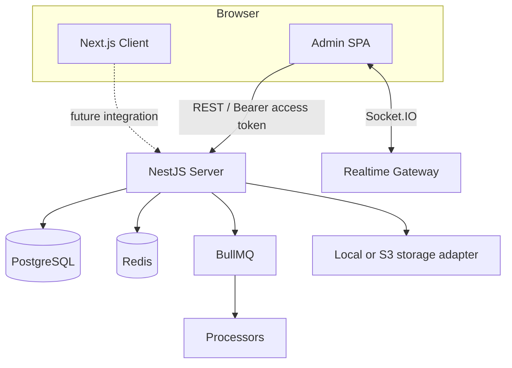
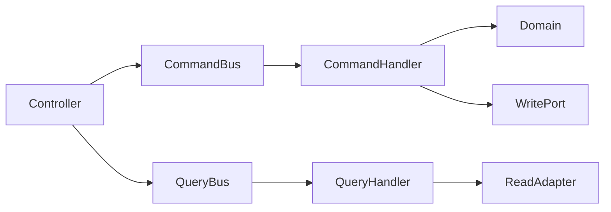
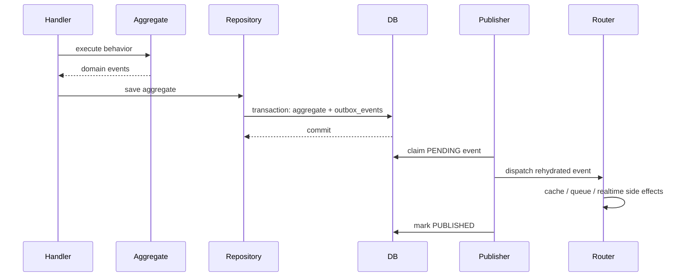
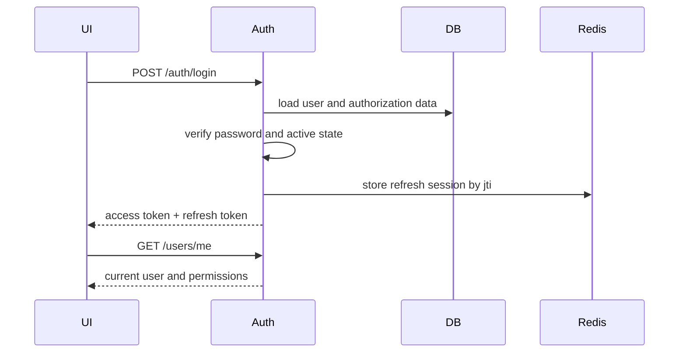

# Kiến trúc hệ thống

> **Phần II · Chương 5 — Từ request đến toàn hệ thống**
>
> Chương trước: [Công cụ và thư viện](tech-stack.md) · [Mục lục handbook](README.md) · Chương sau: [Backend Architecture](../apps/server/README.md)

Chương này trả lời câu hỏi lớn nhất: khi người dùng bấm một nút, code nào chạy từ trình duyệt đến database rồi quay lại? Hãy đọc theo thứ tự. Phần đầu dựng bức tranh toàn hệ thống; những tên kiến trúc chỉ xuất hiện sau khi ta đã nhìn thấy vấn đề mà chúng giải quyết.

Câu chuyện xuyên suốt là quản trị viên tạo một user. Admin gửi request. Backend kiểm tra người gọi là ai và có quyền hay không. Sau đó backend tạo tài khoản và lưu đồng thời một lời nhắc rằng email chào mừng cần được gửi. Tiến trình chạy nền đọc lời nhắc rồi gửi email. Mỗi phần sau sẽ phóng to một đoạn và giới thiệu tên kỹ thuật tương ứng.

Tài liệu này giải thích cấu trúc đang chạy của monorepo: phần nào thuộc quyền sở hữu của ai, các tầng phụ thuộc nhau theo chiều nào, một request đi qua những bước gì, transaction được quản lý ra sao, đăng nhập/phân quyền hoạt động thế nào, frontend giữ state ở đâu, và những điểm chưa hoàn thiện. Tài liệu không dùng “Clean Architecture”, “DDD” hoặc “enterprise” như nhãn trang trí; mỗi khái niệm được gắn với file và behavior thực tế.

## 1. Bức tranh toàn hệ thống

Repository có ba chương trình có thể chạy độc lập:

- `server` lưu dữ liệu và quyết định quy tắc cuối cùng về tài khoản, quyền, thông báo và audit. Vì vậy nó là **nguồn dữ liệu gốc** (system of record).
- `admin` là giao diện quản trị chạy trong trình duyệt và gọi thẳng API.
- `client` là ứng dụng Next.js cho người dùng cuối. Trình duyệt gọi Next.js, rồi Next.js mới gọi API để token không lộ xuống browser.



PostgreSQL lưu dữ liệu nghiệp vụ lâu dài và bảng outbox. Redis lưu các phiên refresh, cache và hạ tầng queue. Access token là JWT sống ngắn; muốn thu hồi ngay một token đã phát thì hệ thống còn phải dựa vào `tokenVersion` và cách quản lý session được mô tả trong Auth handbook.

Notification read model trả cả page items lẫn `unreadCount` trên toàn mailbox. Badge phía client không được suy ra từ page đang tải. Mark-read dùng optimistic cache có rollback, còn realtime chỉ đóng vai trò tín hiệu invalidate vì HTTP/database mới là nguồn sự thật.

## 2. Ranh giới giữa application và package dùng chung

`apps` chứa những phần chạy được và triển khai được (executable/deployable unit). `packages` chứa code mà các app import lúc biên dịch (compile-time dependency) — tự nó không chạy độc lập.

```text
apps/server  ─┬─> @repo/database
              ├─> @repo/contracts
              └─> @repo/types

apps/admin  ──┬─> @repo/contracts
              └─> @repo/types

apps/client  ──┬─> @repo/contracts
               └─> @repo/types
```

### `@repo/contracts`

Chứa permission constants và contract ổn định cần được nhiều app hiểu giống nhau. Package này không chứa NestJS decorator, React hook hoặc persistence implementation.

### `@repo/types`

Chứa các data shape chia sẻ như `User`, `Role`, `Permission`, pagination và notification. Type dùng chung giúp trình biên dịch phát hiện khi hai app hiểu contract khác nhau (contract drift), nhưng không thay thế việc kiểm tra dữ liệu thật lúc chạy (runtime validation) ở ranh giới API.

### `@repo/database`

Sở hữu Prisma schema, migration và client được sinh ra để export. Chỉ backend được phép coi Prisma model là model lưu trữ (persistence model). Frontend không phụ thuộc package database.

### Configuration packages

`@repo/eslint-config` và `@repo/typescript-config` chuẩn hóa bộ công cụ lint và TypeScript cho toàn repo. Chúng chỉ dùng lúc phát triển, không được nạp khi ứng dụng chạy.

## Phần lõi và capability tùy chọn của starter

Không phải dự án tạo từ starter đều cần dùng toàn bộ hệ thống ngay ngày đầu. Phần lõi là những quy ước nên giữ lại: ranh giới workspace, validation môi trường, authentication/authorization, migration dữ liệu, error contract, logging cơ bản và các quality gate trong CI. Chúng tạo ra một cách phát triển và phát hành nhất quán.

Outbox, BullMQ worker, realtime, audit log, metrics, S3-compatible storage và bộ Docker Compose production-like là các capability mẫu. Hãy bật chúng khi bài toán thật cần giao việc bất đồng bộ, giao tiếp realtime, truy vết, quan sát vận hành, object storage hoặc self-hosting. Có thể bỏ một capability khỏi dự án con nếu đã gỡ cả module, biến môi trường, hạ tầng, test và tài liệu liên quan; không nên để một nửa implementation “phòng khi cần”.

Điều làm repository này trở thành advanced starter không phải số lượng công nghệ phải dùng. Giá trị của nó là mỗi capability có ranh giới, contract, test và đường vận hành đủ rõ để đội dự án chọn có chủ đích.

## 3. Backend: bounded contexts và layers

Backend nằm tại `apps/server/src`.

```text
src/
├── contexts/
│   ├── iam/
│   │   ├── auth/
│   │   ├── users/
│   │   └── roles/
│   ├── audit/
│   ├── notifications/
│   ├── analytics/dashboard/
│   ├── storage/
│   └── menu/
├── shared/
│   ├── domain/
│   └── application/
├── infrastructure/
│   ├── database/
│   ├── cache/
│   ├── queue/
│   ├── realtime/
│   ├── event-bus/
│   └── health/
├── presentation/
└── app.module.ts
```

Không phải context nào cũng cần đủ bốn layer. CRUD/read-only context nhỏ có thể chỉ có application và presentation. Layer được tạo khi có trách nhiệm thật, không để thỏa mãn cây thư mục.

Tên `contexts/` biểu thị ranh giới ownership, nhưng cấp thư mục không đồng nghĩa tất cả đều có cùng độ lớn. Taxonomy hiện tại là:

| Cấp ownership              | Thành phần                    | Ý nghĩa                                                                                |
| -------------------------- | ----------------------------- | -------------------------------------------------------------------------------------- |
| Bounded context lớn        | `iam`                         | Identity & Access Management; chứa ba module cộng tác chặt.                            |
| Module nghiệp vụ trong IAM | `auth`, `users`, `roles`      | Mỗi module sở hữu model/use case riêng nhưng dùng port công khai của nhau.             |
| Bounded context hỗ trợ     | `audit`, `notifications`      | Sở hữu dữ liệu, rule và API độc lập; nhận tác động từ context khác qua contract/event. |
| Capability nhỏ             | `analytics/dashboard`, `menu` | Read model/application capability; không tạo domain layer giả nếu không có invariant.  |
| Technical capability       | `storage`                     | Cung cấp application port và adapter local/S3; không phải business domain.             |

Vì vậy `menu` chỉ có application/presentation không phải “Clean Architecture thiếu file”. Dependency direction mới là điều bắt buộc; số thư mục không phải thước đo chất lượng.

### Domain

Domain chứa entity, value object, domain event, exception và repository contract làm việc với aggregate. Domain không import NestJS, Prisma, Redis hoặc application port kỹ thuật.

Ví dụ: aggregate Users quyết định user đang active hay không, profile ra sao và những sự kiện nghiệp vụ nào đã xảy ra. Nó không tự gửi WebSocket hay xếp email vào queue.

### Application

Application chứa command/query, handler và application port. Handler điều phối:

```text
load state
→ gọi domain behavior
→ persistence qua port
→ trả result
```

Command dùng cho luồng thay đổi dữ liệu; query dùng cho luồng chỉ đọc. Repository hoặc application service được inject qua token/port, nhờ đó handler chỉ biết "mình cần một chỗ lưu dữ liệu" chứ không biết cụ thể ai triển khai chỗ đó.

### Infrastructure

Infrastructure là nơi các port được triển khai thật bằng Prisma, Redis, BullMQ, Socket.IO hoặc storage SDK. Đây cũng là nơi đặt outbox publisher (bộ phát event từ bảng outbox) và event router (bộ chia event về đúng nơi xử lý).

### Presentation

Presentation chuyển HTTP/WebSocket transport sang application input:

```text
HTTP request
→ validation pipe
→ guard
→ controller
→ command/query bus
→ presenter/response
```

Controller không giữ quy tắc nghiệp vụ (invariant) và không tự mở/đóng transaction nghiệp vụ.

## 4. Dependency direction

Dependency mong muốn:

```text
Presentation ──> Application ──> Domain
Infrastructure ────────────────> Domain/Application ports
```

Module lắp ráp (composition module) là nơi duy nhất biết cả interface trừu tượng lẫn class triển khai, để nối chúng lại với nhau. Domain không biết gì về nơi lắp ráp này.

Shared domain chỉ chứa primitive thực sự dùng qua nhiều context. Một entity của Users không được chuyển vào shared chỉ vì Roles cần đọc user ID; hai context nên giao tiếp qua contract hoặc application port phù hợp.

Dependency matrix dùng khi review import:

| Code đang đứng ở | Được import                                                                  | Không được import                                              |
| ---------------- | ---------------------------------------------------------------------------- | -------------------------------------------------------------- |
| Domain           | Domain cùng module, `shared/domain`, contract thuần cần cho error/event name | Application, infrastructure, presentation, NestJS/Prisma/Redis |
| Application      | Domain, repository contract và `application/ports`                           | Concrete infrastructure adapter hoặc controller                |
| Infrastructure   | Domain, application port, SDK/driver kỹ thuật                                | Presentation; không tự quyết định business rule                |
| Presentation     | Application command/query, DTO/presenter và public contract                  | Prisma repository/Redis adapter trực tiếp                      |
| Module A         | Public port/contract của module B trong cùng bounded context                 | Entity nội bộ hoặc infrastructure của module B                 |
| Context A        | Shared public contract/integration event                                     | Internal file của context B                                    |

Port convention cố ý phân biệt hai nhóm. Repository contract nằm tại `domain/ports/*.repository.ts` vì nó nhận/trả aggregate. Dependency kỹ thuật do use case gọi nằm tại `application/ports/*.port.ts`, ví dụ password hasher, session store, token store, storage, audit, queue và realtime. Concrete implementation nằm trong `infrastructure` và thường mang suffix `.adapter.ts`, `.store.ts` hoặc `.repository.ts` theo loại công nghệ.

## 5. CQRS trong dự án

CQRS ở đây chỉ có nghĩa là tách handler ghi (command) và handler đọc (query) thành hai loại riêng trong application layer — không phải tách thành hai database, cũng không phải dựng hệ thống event sourcing.



Command có thể trả về dữ liệu mà client cần, nhưng mục đích chính của nó là thay đổi dữ liệu. Query chỉ đọc — nó không được gây ra bất kỳ thay đổi nghiệp vụ nào (side effect).

Không phải mọi endpoint đều buộc dùng CQRS nếu context rất nhỏ; quyết định phải nhất quán trong context và được ghi trong handbook của context đó.

## 6. Transactional outbox

Domain event không được phát đi ngay bên trong database transaction. Thay vào đó, repository chuyển event thành dạng lưu được (serialize) rồi ghi vào bảng outbox cùng lúc với aggregate, trong cùng một transaction Prisma — nhờ vậy hoặc cả hai cùng được lưu, hoặc không gì được lưu.



Cơ chế giao event là at-least-once — một event có thể được xử lý nhiều hơn một lần. Vì vậy bên nhận phải idempotent (xử lý lặp lại không gây hậu quả) hoặc dùng định danh cố định để nhận ra event đã xử lý rồi. Publisher "nhận việc" bằng cách đổi status của event — chỉ ai đổi được status thì người đó xử lý, nhờ vậy nhiều instance không giẫm chân nhau. Mỗi lần thử, nó tăng bộ đếm attempts; thất bại thì chờ một khoảng rồi thử lại; vượt số lần cho phép thì chuyển event sang `FAILED`.

`recoverStaleClaims` tìm những event kẹt ở trạng thái `PROCESSING` vì worker chết giữa chừng, rồi trả chúng về `PENDING` để được xử lý lại. Khi hạ tầng (database, kết nối) gặp lỗi, vòng polling giãn dần thời gian chờ (tối đa 30 giây) và chỉ ghi log ở thời điểm đổi trạng thái — hạ tầng sập không làm ngập log. Row `PUBLISHED` được dọn theo tuổi mỗi giờ (`OUTBOX_RETENTION_DAYS`, mặc định 30 ngày).

## 7. Authentication và authorization

Auth còn sở hữu policy xác minh email. User aggregate giữ trạng thái `emailVerifiedAt`, nhưng Auth sinh/consume token, điều phối mail và chặn login khi `EMAIL_VERIFICATION_REQUIRED=true`. Việc chia như vậy giữ Users là nguồn sự thật về danh tính, còn quy trình chứng minh danh tính nằm cùng các use case đăng ký và đăng nhập. Token gốc không đi vào aggregate hoặc log; PostgreSQL chỉ lưu hash và worker nhận một job nhạy cảm có vòng đời ngắn.

### Token model

- Access token sống ngắn, được gửi qua header `Authorization: Bearer`.
- Refresh token đại diện cho một phiên đăng nhập (session) có bản ghi trạng thái lưu trong Redis.
- Access token mang JTI của refresh session tương ứng để API có thể nhận diện phiên hiện tại mà không đọc refresh cookie.
- Mỗi lần refresh, hệ thống phát cặp token mới và thu hồi token của phiên cũ (refresh rotation). Redis thực hiện bước consume old JTI và tạo new JTI bằng một Lua script atomic; hai request dùng cùng token không thể cùng thắng.
- Mỗi user có số `tokenVersion`; khi trạng thái bảo mật của user thay đổi, tăng số này sẽ vô hiệu hóa mọi access token đã phát trước đó.

Flow login:



Route guard xác minh người gọi là ai (identity); permission guard kiểm tra người đó được phép làm gì. Permission guard phía frontend chỉ giúp trải nghiệm người dùng gọn hơn — chốt chặn bảo mật thật nằm ở backend.

Admin giữ access token trong bộ nhớ; reload trang sẽ làm token này biến mất. Refresh token sống lâu hơn nằm trong cookie `HttpOnly` giới hạn ở path `/auth`, nên JavaScript không đọc được nó.

Khi Admin xin token mới bằng cookie, response body chỉ trả access token; refresh token mới được thay ngay trong cookie. Client không dùng browser cookie, chẳng hạn mobile app, có thể gửi refresh token bằng `Authorization: Bearer` và nhận cả cặp token trong body.

Nếu nhiều request cùng nhận `401`, API client gom chúng vào một lần refresh rồi thử lại mỗi request đúng một lần. Nếu refresh thất bại, ứng dụng phát tín hiệu logout.

Next.js BFF gom các request refresh trùng nhau trong phạm vi một instance. Nếu hai request đi tới hai instance khác nhau, Redis thực hiện atomically ba việc: consume JTI cũ, tạo session mang JTI mới và lưu kết quả refresh trong 5 giây. Request đồng thời đến sau nhận đúng kết quả đã phát hành thay vì tạo thêm session hoặc nhận `401`. Do đó mọi BFF replica ghi cùng một cookie mới, còn refresh token cũ vẫn hết khả năng sử dụng sau cửa sổ chống race rất ngắn.

Replay record chứa JTI kế nhiệm để thao tác revoke có thể tìm và xóa nó; cặp token bên trong được mã hóa AES-256-GCM bằng khóa dẫn xuất từ `JWT_REFRESH_SECRET`, không nằm dạng plaintext trong Redis. Logout một session, revoke các session khác và global logout đều dọn replay; đây là invariant ngăn một kết quả refresh tạm thời làm sống lại session đã bị người dùng thu hồi.

Logout ở BFF phải gọi `/auth/logout` để thu hồi session trong Redis rồi mới xóa cookie JWE. Chỉ xóa cookie trên browser chưa phải logout hoàn chỉnh.

Session lifecycle phân biệt hai use case: `logout/global` xóa mọi refresh session và tăng `tokenVersion` để đá tất cả thiết bị ngay; `sessions/revoke-others` được xác thực bằng refresh cookie và bảo toàn JTI hiện tại. Hai endpoint không thể dùng thay thế cho nhau.

Password reset đi qua cả Auth và Users nhưng không làm mờ ownership. Auth sở hữu token reset một lần: sinh entropy, hash trước khi lưu, kiểm tra hạn và consume atomically. Users cung cấp credential-write port chỉ cập nhật password hash và tăng `tokenVersion`; Auth không gọi Prisma User trực tiếp và cũng không save một snapshot aggregate cũ có thể ghi đè role/profile vừa đổi. Link gốc chỉ tồn tại trong email job sensitive; BullMQ xóa payload đó sau completion hoặc final failure. Sau khi consume token, mọi Redis session bị thu hồi trước credential write, nên thiết bị cũ không có cửa sổ refresh sang credential state mới.

## 8. Audit

Audit là một bounded context riêng với năng lực application đầy đủ, không phải vài dòng `console.log`. Tầng application gọi audit port; adapter Prisma ghi bản ghi bền vững xuống database, gồm ai làm (actor), làm gì (action), lên đối tượng nào (target), kèm IP, user agent, correlation ID và chi tiết phù hợp. Correlation ID đi từ request context vào cả HTTP log, audit record, outbox và queue, nên operator có thể lần một hành động quản trị qua các process mà không dựa vào timestamp gần giống nhau.

Admin đọc audit như một read model: URL sở hữu search/pagination, TanStack Query sở hữu response phân trang, còn presentation mapper chuyển action code thành nhãn và severity. Việc tách mapper giúp backend giữ event vocabulary ổn định trong khi UI vẫn có thể địa phương hóa mà không sửa dữ liệu lịch sử.

Khi ghi audit thất bại, mỗi use case phải chọn rõ cách xử lý: ghi được thì tốt (best-effort), hay coi cả thao tác nghiệp vụ là thất bại. Không được lẳng lặng nuốt lỗi nếu audit là yêu cầu tuân thủ (compliance).

## 9. Admin frontend architecture

Admin dùng feature-based modular architecture:

```text
features/users/
├── api/
│   ├── user.api.ts
│   └── user.keys.ts
├── components/
├── hooks/
├── index.ts                 # capability/API public dùng chéo
└── pages.ts                 # route entry public, luôn lazy import
```

Flow dữ liệu:

```text
Component
→ feature hook
→ TanStack Query
→ feature API adapter
→ shared ApiClient
→ backend
```

### Phần nào sở hữu loại state nào?

| State                               | Owner           |
| ----------------------------------- | --------------- |
| API/server data                     | TanStack Query  |
| Authenticated user/session state    | Zustand         |
| Route, shareable filter, pagination | React Router    |
| Modal, form draft, local selection  | React component |
| Theme                               | Theme provider  |

Query-key factory định nghĩa "địa chỉ" của từng mẩu dữ liệu trong cache. Sau mỗi mutation, cache của cả feature bị đánh dấu là cũ (invalidate root key) để dữ liệu được tải lại. Mỗi màn hình phân biệt rõ bốn trạng thái: đang tải, lỗi có thể thử lại, không có dữ liệu, và thành công.

Policy server-state nằm tại `src/app/query-client.ts`, không nằm rải rác trong page. Read query chỉ tự retry tối đa hai lần đối với lỗi có khả năng tạm thời: browser network error, HTTP 408, 429 và 5xx; 4xx còn lại dừng ngay. Mutation không tự retry vì command có thể không idempotent và response bị mất không đồng nghĩa server chưa thực thi. Sau khi policy kết thúc retry, feature chuyển sang error state có nút thử lại để quyết định tiếp tục thuộc về người dùng.

Danh sách nghiệp vụ dùng URL làm nguồn sự thật cho filter và pagination khi trạng thái đó cần bookmark, reload hoặc Back/Forward. Ví dụ Users ánh xạ `?q=member&page=2` vào tham số query của `useUsers`; draft tìm kiếm chỉ tồn tại cục bộ trong 300 ms debounce. Dữ liệu phụ thuộc quyền như danh sách role được query có điều kiện, chỉ khi principal có capability tạo hoặc sửa user.

Users là mẫu page orchestration của Admin: page sở hữu URL/capability/dialog, data table sở hữu presentation của danh sách, shared form fields sở hữu semantic field markup, còn feature hook sở hữu query/mutation/cache. Create và edit dùng chung field set nhưng giữ submit contract riêng vì create có password bắt buộc còn edit định danh user và không gửi password. Mutation failure không xóa form draft; dialog chỉ đóng sau command và cache invalidation thành công.

Mutation cần xác nhận trả về Promise tới component. Shared `ConfirmDialog` giữ pending state và chỉ đóng sau khi mutation cùng cache invalidation hoàn tất; lỗi giữ dialog mở để retry. Validation phía form phản chiếu các constraint công khai để phản hồi sớm, nhưng không thay thế validation và authorization ở backend.

Với mutation kiểu read-modify-write, component không được gửi đồng thời nhiều bản cập nhật được tính từ cùng một cache snapshot. Ma trận Roles là ví dụ: endpoint thay thế toàn bộ tập permission, nên `useRoles` tuần tự hóa thao tác checkbox và giữ chúng disabled cho tới khi invalidate/refetch hoàn tất. Nếu cần throughput cao hơn trong tương lai, contract phải đổi sang add/remove delta hoặc backend phải có optimistic concurrency token; chỉ bỏ khóa ở frontend là không an toàn.

### Ranh giới giữa các module

Dependency direction được ESLint thực thi, không chỉ ghi trong tài liệu:

| Nguồn          | Được phép phụ thuộc                                                     |
| -------------- | ----------------------------------------------------------------------- |
| `lib`, `hooks` | package ngoài và module shared cùng tầng                                |
| `components`   | `lib`, hook kỹ thuật và UI primitive; không được biết app/route/feature |
| `features/<A>` | shared layer và public API `features/<B>`                               |
| `app`          | shared layer và public feature API                                      |
| `routes`       | app boundary và `features/<name>/pages`                                 |

Deep import `@/features/<name>/...` bị cấm, ngoại trừ public route entry `pages`. Feature capability dùng chéo đi qua `index.ts`; page route đi qua `pages.ts`. Tách hai entry giữ lazy loading đúng: auth store hoặc role API có thể được import tĩnh mà không kéo Login/Roles page vào initial bundle. Application-aware shell và permission guard nằm trong `app`, không nằm trong `components`; vì vậy shared component không cần ngoại lệ để đọc auth hoặc notifications.

### Runtime composition

`main.tsx` render `App`. `App` khởi động phần auth, rồi lắp QueryClient, theme, realtime provider, router, toaster và error boundary cho toàn ứng dụng. Route registry chỉ tải code của trang khi người dùng mở đến trang đó (lazy-load). `ProtectedRoute` chỉ chặn người chưa đăng nhập; `PermissionGuard` bảo vệ route/action theo quyền.

Resilience được chia theo phạm vi lỗi. `QueryErrorState` xử lý lỗi server-state dự kiến và giữ phần còn lại của trang hoạt động; `RouteErrorPage` chặn lỗi lazy route hoặc loader; `ApplicationErrorBoundary` là chốt cuối cho lỗi render không dự kiến. Hai boundary cấp cao ghi lỗi kỹ thuật để chẩn đoán nhưng chỉ hiển thị thông điệp đã kiểm soát, không phản chiếu raw `Error.message` có thể chứa endpoint, identifier hoặc dữ liệu nhạy cảm.

Admin production configuration là một typed boundary tại `src/config`. `VITE_API_URL` là public build-time value duy nhất hiện có; production không có fallback và không chấp nhận localhost. Cùng contract sinh CSP cho đúng API/WebSocket origin, nên HTTP client, realtime, avatar URL và browser policy không thể lệch nhau. Vercel chỉ sở hữu static hosting concerns: immutable asset cache, HTML no-cache, security headers và catch-all SPA rewrite. Source map không được public trong artifact.

Realtime là một application boundary độc lập trong `src/app/realtime`: client adapter tạo Socket.IO connection và chỉ truyền access token qua handshake auth; event-handler adapter chuyển transport event thành logout, toast, observability hoặc query invalidation; `RealtimeProvider` đăng ký listener trước khi chủ động connect, sở hữu vòng đời socket theo auth state và cập nhật credential khi HTTP client refresh token. Lỗi handshake có mã auth mới kết thúc phiên; lỗi transport tạm thời chỉ được ghi nhận và reconnect. Việc tách boundary khỏi `ProtectedRoute` giữ routing thuần về access control, đồng thời bảo đảm chỉ có một nơi mở, đăng ký listener và cleanup kết nối realtime.

Kiến trúc này được kiểm tra ở hai tầng. Vitest cô lập store, route guard, client adapter và event handler để phản hồi nhanh. Playwright chạy Chromium với NestJS, PostgreSQL và Redis thật qua hai frontend: suite Admin kiểm tra Vite SPA, HttpOnly refresh, RBAC và `force_logout`; suite Client kiểm tra Next.js BFF, redirect route riêng tư, JWE session cookie, hồ sơ SSR, reload và logout. Cả hai dùng database `admin_browser_e2e` có thể xóa bỏ, không dùng chung database development.

Client acceptance suite cũng kiểm tra token rotation thật. Test tạo JWE session giống Next.js nhưng cố ý đặt access token hết hạn, trong khi refresh token vẫn là token do backend ký và được Redis theo dõi. Một request phải refresh trước khi SSR; token đã revoke phải xóa BFF cookie; hai request đồng thời phải cùng nhận kết quả refresh. Next runtime giữ success promise thêm 5 giây để hấp thụ request đã mang cookie cũ nhưng đến muộn; failure bị xóa ngay để lỗi mạng có thể retry. Nhờ vậy bài test không phụ thuộc thời gian chờ 15 phút và không cần cài “test mode” vào production handler.

Client App Router dùng ba route group không xuất hiện trên URL: `(public)`, `(auth)` và `(protected)`. Protected layout là composition boundary của khu vực tài khoản: nó xác nhận BFF session, lấy current user qua server-only request cache rồi dựng account shell. Feature page như `/me` không tự lặp auth redirect, header hay logout. Proxy vẫn đứng trước layout để refresh token trước SSR; backend mới là security authority cuối cùng cho ownership và policy nghiệp vụ.

Dashboard là composition của ba query độc lập: business stats là boundary chặn toàn trang; health và recent audit là widget phụ có loading/error/empty state riêng. Partial failure không được biến thành empty state và không che dữ liệu từ nguồn còn hoạt động. Biểu đồ đơn giản được render bằng SVG/CSS nội bộ có semantic text/meter thay vì kéo một chart runtime lớn; route vẫn là đơn vị lazy-load duy nhất.

Chi tiết đầy đủ nằm trong [Admin handbook](../apps/admin/README.md).

## 10. Next.js client architecture

Client dùng Next.js App Router và React Server Components. Auth theo mô hình BFF: Next.js sở hữu session cookie HttpOnly, đọc access token ở phía server để gọi API, và làm mới token trong middleware (Next.js không cho ghi cookie lúc render trang). Nhờ vậy trang công khai có SEO thật và trình duyệt không bao giờ giữ token. Chi tiết và đánh đổi so với mô hình bearer của Admin: xem Client handbook.

Khi phát triển, định hướng là:

```text
app/                       # route composition, layouts, loading/error
features/                  # business UI/use cases
shared/api/                # server/client-safe API clients
shared/ui/                 # reusable presentation
shared/config/             # validated environment
```

Không sao chép kiến trúc của Admin SPA một cách máy móc. Next.js có ranh giới server/client, cách cache và cách render khác hẳn; quyết định fetch dữ liệu ở đâu phải dựa trên nơi dữ liệu được dùng và yêu cầu bảo mật.

## 11. Production process topology

Backend production không phải một process duy nhất. API và BullMQ worker được build từ cùng Docker image để giữ cùng code/version, nhưng deploy thành hai service có lifecycle độc lập. API sở hữu HTTP, Socket.IO, outbox polling và queue producer; worker chỉ sở hữu queue consumer. PostgreSQL và Redis chỉ được truy cập qua private network.

Migration là release step chạy một lần trước API rollout, không nằm trong startup của API/worker. `apps/server/Dockerfile` là runtime artifact boundary; `scripts/migrate.mjs` là migration entrypoint. Deployment composition root hiện tại là Compose và có thể được thay bằng Terraform/ECS hoặc nền tảng container khác, nhưng không được thay đổi process boundary này. Đọc [deployment contract không phụ thuộc nhà cung cấp](provider-neutral-deployment.md) để biết phần nào phải giữ nguyên khi đổi hạ tầng.

## 12. Database và migration

Prisma schema mô tả trạng thái hiện tại mà database phải có (khai báo "nó phải trông thế này"); migrations là lịch sử từng bước thay đổi để đi đến trạng thái đó.

```text
schema change
→ prisma migrate dev
→ review migration.sql
→ commit schema + migration
→ CI dựng database rỗng, apply migrations và diff với schema hiện tại
→ deployment runs migrate deploy
```

`prisma generate` chỉ sinh ra client, không đụng đến database. `db push` ép database khớp schema mà không ghi lại lịch sử migration, nên không được dùng làm cách triển khai production.

Database local đã được đánh dấu "các migration này coi như đã chạy" một cách có chủ đích (baseline bằng `prisma migrate resolve --applied` cho toàn bộ chain), và chuỗi migration đã được xác nhận là dựng lại được đầy đủ schema trên một database trống. Môi trường mới dựng bằng `prisma migrate deploy`; `db push` chỉ còn dành cho database test dùng xong bỏ.

## 13. Runtime topology

Local mặc định:

```text
Host: pnpm dev → server + admin + client
Docker: PostgreSQL + Redis + Maildev
```

Production mục tiêu:

```text
immutable API image (nhiều replica được — Socket.IO đã có Redis adapter)
immutable worker image (node dist/worker.js — cùng image với API, entry khác)
immutable Next.js image
static Admin assets/CDN
managed PostgreSQL
managed Redis
object storage
external mail provider
```

API và worker là hai process tách biệt build từ cùng một image: API nhận HTTP/WebSocket và đẩy job vào queue; worker (`src/worker.module.ts`) chỉ tiêu thụ job — email gửi chậm không chiếm event loop của API. Realtime emit theo room `user:{id}` qua `@socket.io/redis-adapter`, nên sự kiện phát từ instance này tới được socket đang nối vào instance khác.

Browser xác thực Socket.IO bằng access token trong `handshake.auth.token`; token không được đưa vào query string vì URL có thể bị proxy hoặc access log ghi lại. Gateway vẫn đọc query token như compatibility fallback cho client cũ, nhưng frontend hiện tại không sử dụng đường này. Handshake middleware verify chữ ký rồi gọi cùng `AccessTokenValidator` với HTTP JWT strategy, bao gồm trạng thái user, `tokenVersion` và session JTI trong Redis. Token có chữ ký đúng nhưng đã bị thu hồi vì thế bị từ chối ở cả HTTP lẫn WebSocket. HTTP token rotation cập nhật `socket.auth`, nên mọi reconnect sau đó dùng access token mới.

Container dùng cho development không phải là image dùng cho production. Container production không mount source code từ máy ngoài vào (bind mount), không chạy chế độ theo dõi file (watch mode) và không cài dependency lúc khởi động.

## 14. Failure handling và observability

Hệ thống đã có:

- correlation ID (mã định danh gắn theo một request để lần theo dấu vết của nó trong log) cho luồng HTTP;
- structured logging tập trung qua `nestjs-pino`: JSON ở production/test, pino-pretty ở development, redact credential/cookie và các field email/token/password phổ biến. API lẫn worker đều lắp cùng `logger.config.ts` qua `app.useLogger` + `bufferLogs`; processor không ghép email người dùng vào message tự do;
- Prometheus endpoint `GET /metrics` (`src/infrastructure/metrics/`): default process metrics, histogram `http_request_duration_seconds` gắn nhãn theo route template (không phải raw URL, tránh nổ cardinality), gauge outbox và gauge BullMQ theo tập status cố định. Với Compose production, API còn đọc bind mount backup ở chế độ read-only để xuất `backup_status_available`, `backup_last_success_timestamp_seconds` và `backup_age_seconds`. Backup không tham gia readiness: bản sao lưu lỗi phải cảnh báo operator nhưng không được tự làm API ngừng phục vụ. API đọc queue state từ Redis dùng chung nên worker không cần mở một HTTP server thứ hai. Production chỉ cho scrape bằng Bearer `METRICS_TOKEN`;
- lỗi domain và lỗi API được chuyển thành response có cấu trúc thống nhất;
- health checks;
- audit được ghi bền vững xuống database;
- audit retention là policy cấu hình, mặc định tắt. Khi số ngày dương, lifecycle service của Audit xóa record cũ mỗi ngày qua index `createdAt`; cleanup fail-open và không thay thế archive/legal hold;
- bảng outbox lưu số lần thử (attempts) và lỗi gần nhất của từng event;
- frontend có giao diện thử lại khi query lỗi, cùng error boundary ở mức toàn ứng dụng và từng route;
- frontend observability adapter tạo structured incident, redact credential, giữ `x-correlation-id` của API error và tách boundary khỏi SDK của telemetry vendor. Sink production đi qua cửa sổ giới hạn theo từng tab: chặn cả tổng report và số lần lặp của cùng fingerprint để một render/socket loop không tạo incident flood.
- Client BFF ghi `client.bff.api_failed` ở server boundary và cô lập lỗi của telemetry sink. Rate limiter theo từng Next.js instance chặn tổng event/cùng fingerprint; các lần bị nén được biểu diễn bằng summary ở mốc lũy thừa hai để operator vẫn thấy outage đang lan rộng mà log không tăng tuyến tính theo traffic.

Outbox publisher đã có exponential backoff tối đa 30 giây, chỉ log lần lỗi đầu/chạm trần và log recovery; vì vậy lỗi database
không còn ghi theo poll interval 100 ms. Phần còn phụ thuộc dự án thật là chọn telemetry provider production, cấu hình sampling
và quota toàn hệ thống, upload source map riêng tư và đặt access/retention policy cho frontend incident.

## 15. Kiểm thử

Backend test pyramid:

```text
domain unit
→ handler/service unit
→ adapter integration
→ HTTP E2E với database/Redis test
```

Admin hiện có unit test chống thoái lui (regression) cho luồng refresh của API client, bộ đánh giá permission và query keys. Cần bổ sung tiếp test cho route guard, tương tác component, mutation của từng feature và E2E chạy trên trình duyệt thật.

Client chưa có business tests vì chưa có business behavior.

## 16. Cách đánh giá một thay đổi kiến trúc

Một abstraction chỉ nên được thêm khi nó:

1. tạo ra một ranh giới có ý nghĩa;
2. loại bỏ sự phụ thuộc chằng chịt (coupling) hoặc sự mập mờ;
3. có tên theo đúng ngôn ngữ của hệ thống;
4. giữ đúng chiều phụ thuộc giữa các tầng;
5. có thể được kiểm thử;
6. được một luồng nghiệp vụ thực tế sử dụng.

Không tạo interface cho mọi class, mapper cho mọi object hoặc layer rỗng chỉ để cây thư mục trông “chuẩn”. Kiến trúc "enterprise" thật sự nằm ở khả năng kiểm soát thay đổi và sự cố, không phải ở số lượng pattern.
