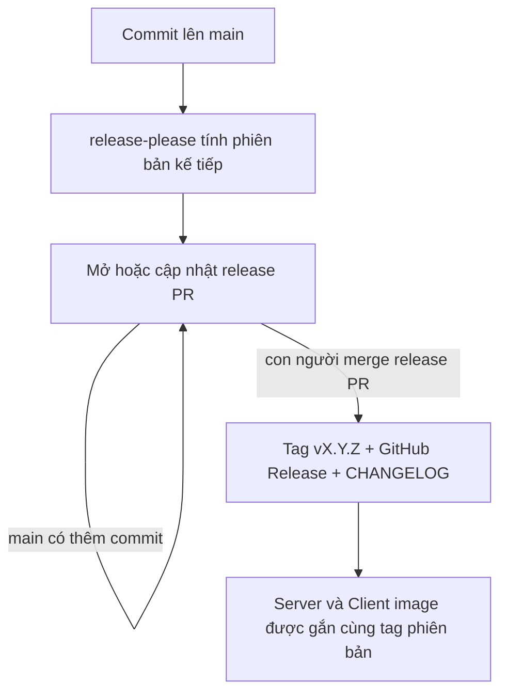

# Quy trình phát hành

> **Phần IV · Chương 17 — Từ commit đến phiên bản có thể rollback**
>
> Chương trước: [Deployment readiness](deployment-readiness.md) · [Mục lục handbook](README.md) · Chương sau: [Operations Runbook](operations-runbook.md)

Build thành công chưa phải là release. Release là một quyết định có thể truy vết: ta chọn tập thay đổi nào, gắn cho nó version nào, image nào đúng là artifact đã qua CI và nếu lỗi thì quay về đâu.

Chương này theo một commit `feat:` từ lúc merge vào `main`, qua release-please, Git tag và GHCR image tag. Điểm quan trọng nhất là “build once”: artifact được phát hành chính là artifact đã được kiểm thử, không phải một image được build lại sau đó.

Tài liệu này trả lời ba câu hỏi: phiên bản của repo được đánh số thế nào, một bản phát hành ra đời qua những bước nào, và khi cần quay lui thì bám vào đâu.

> Gặp từ lạ? Tra [Bảng thuật ngữ](glossary.md).

## 1. Đánh số phiên bản: semver

Repo dùng **semver** (semantic versioning) — số phiên bản gồm ba phần `MAJOR.MINOR.PATCH`, ví dụ `1.4.2`:

| Phần      | Tăng khi nào                               | Ví dụ đời thường                           |
| --------- | ------------------------------------------ | ------------------------------------------ |
| **PATCH** | Sửa lỗi, không đổi cách dùng               | Vá ổ gà trên đường — đi lại như cũ         |
| **MINOR** | Thêm tính năng, cái cũ vẫn chạy y nguyên   | Mở thêm làn đường mới — làn cũ vẫn đó      |
| **MAJOR** | Thay đổi phá vỡ: cái đang chạy có thể hỏng | Đổi chiều lưu thông — ai cũng phải học lại |

Không ai phải tự quyết định con số. Nó được **tính tự động từ lịch sử commit** — đây là lý do repo ép kiểu commit conventional ngay từ hook `commit-msg`:

| Commit bắt đầu bằng                        | Phiên bản tăng |
| ------------------------------------------ | -------------- |
| `fix:`                                     | PATCH          |
| `feat:`                                    | MINOR          |
| `feat!:` hoặc footer `BREAKING CHANGE:`    | MAJOR          |
| `docs:` `test:` `ci:` `chore:` `refactor:` | Không tăng     |

## 2. Một bản phát hành ra đời thế nào

Công cụ đứng giữa là **release-please** (chạy trong [`.github/workflows/release.yml`](../.github/workflows/release.yml)). Nó không phát hành ngay mỗi lần merge — nó **gom** các thay đổi lại thành một PR đặc biệt, và con người quyết định thời điểm bấm nút.



Diễn giải từng bước:

1. **Làm việc bình thường.** Mọi người cứ merge commit `feat:`/`fix:` vào `main` như trước, không thêm thao tác gì.
2. **Release PR tự xuất hiện.** Sau commit đầu tiên đáng phát hành, một PR tên kiểu `chore(main): release 1.1.0` được bot mở ra. Nội dung PR chính là bản nháp CHANGELOG — mỗi commit `feat:`/`fix:` thành một dòng. `main` có thêm commit thì PR tự cập nhật, con số phiên bản tự nhích theo.
3. **Phát hành = merge release PR.** Đây là hành động có chủ đích duy nhất trong cả quy trình. Merge xong, bot tạo tag `vX.Y.Z`, tạo GitHub Release kèm ghi chú, và ghi vào `CHANGELOG.md`.
4. **Hai image nhận cùng tag phiên bản.** Job `tag-image` chạy thành hai nhánh cho `server` và `client`. Mỗi nhánh chờ CI push image theo SHA của commit phát hành rồi gắn thêm tag phiên bản — không build lại, vì hai image đó đã qua đủ lint, test, e2e và quét lỗ hổng ở CI. Release job chỉ xanh khi cả hai image đều được gắn tag.

Muốn ép một con số cụ thể (ví dụ phát hành `2.0.0` dù chưa có commit `feat!:`), thêm footer vào commit message:

```text
feat: chuyển sang API v2

Release-As: 2.0.0
```

## 3. Ý nghĩa các tag của image trên GHCR

Mỗi package GHCR (`server` và `client`) có thể mang nhiều tag. Hai package dùng cùng version để người vận hành biết frontend và backend thuộc cùng một source state:

| Tag            | Ví dụ        | Dùng để làm gì                                                                              |
| -------------- | ------------ | ------------------------------------------------------------------------------------------- |
| SHA của commit | `abc1234...` | Bất biến, truy vết chính xác — image này build từ đúng commit nào                           |
| Phiên bản      | `1.1.0`      | Thứ con người đọc và deploy: "production đang chạy 1.1.0"                                   |
| `latest`       | `latest`     | Bản mới nhất của `main` — tiện cho môi trường thử, **không** deploy production bằng tag này |

**Quay lui (rollback)** vì vậy là deploy lại tag phiên bản trước đó — ví dụ đang chạy `1.1.0` gặp sự cố thì trỏ service liên quan về `1.0.0`. Không bắt buộc rollback cả hai nếu sự cố chỉ nằm ở một service, nhưng phải ghi lại cặp version thực tế đang chạy. Các bước xử lý sự cố cụ thể nằm ở [Sổ tay vận hành](operations-runbook.md).

## 4. Thiết lập một lần trên GitHub

### Bảo vệ `main`

Repository dùng branch protection để biến quy trình trong tài liệu thành rule thực thi được. `main` yêu cầu pull request, branch phải cập nhật với base và các check lõi phải xanh: quality/build, Backend E2E, Frontend browser E2E, image/SBOM/vulnerability scan cho Server và Client, dependency audit và secret scan. Maintainer cũng không được bỏ qua rule; force-push và delete branch bị tắt.

Merge policy chỉ cho squash merge, tự xóa source branch và cho phép auto-merge sau khi required checks xanh. PR title phải theo Conventional Commits vì nó trở thành commit duy nhất trên `main`. Quy tắc một PR → một commit phát hành giúp release-please không tạo hai changelog entry cho cùng một feature từ merge commit và commit con.

Vercel Preview không nằm trong required checks của starter vì không có API staging thuộc sở hữu repo. Ở dự án sản phẩm, chỉ thêm Vercel vào danh sách bắt buộc sau khi Preview thật sự gọi được backend staging; một deployment chỉ build được với URL `.invalid` vẫn là artifact-only.

### Quyền cho release automation

release-please dùng `GITHUB_TOKEN` để mở PR, mà mặc định GitHub **không cho** Actions tạo PR. Bật một lần tại: **Settings → Actions → General → Workflow permissions → tick "Allow GitHub Actions to create and approve pull requests"**. Repo nằm trong organization thì phải bật ở cả cấp organization (cùng đường dẫn Settings của org) — cấp org tắt thì cấp repo có tick cũng vô hiệu.

Chưa bật mà workflow chạy sẽ lỗi `GitHub Actions is not permitted to create or approve pull requests` — gặp đúng dòng đó thì quay lại đây.

## 5. Vì sao làm theo cách này

- **Không thêm việc cho người viết code.** Kỷ luật duy nhất là conventional commit — thứ hook `commit-msg` đã ép sẵn. Không phải viết file changeset, không phải tự sửa số phiên bản.
- **Phát hành có chủ đích nhưng không thủ công.** Gom nhiều thay đổi vào một bản phát hành hay phát hành ngay một hotfix đều chỉ là chuyện merge release PR sớm hay muộn.
- **Không build lại khi phát hành.** Hai image được gắn tag phiên bản chính là hai image đã qua kiểm tra ở CI, loại trừ khả năng "bản test một đằng, bản phát hành một nẻo".

Một điều tinh tế đáng biết: tag do `GITHUB_TOKEN` tạo ra **không kích hoạt workflow khác** (GitHub chặn để tránh bot gọi bot vòng lặp vô hạn). Vì vậy đừng viết workflow mới kiểu `on: push: tags: [v*]` và mong nó chạy khi release-please tạo tag — nó sẽ im lặng không chạy. Việc gì cần làm lúc phát hành thì đặt vào job sau `release-please` trong chính `release.yml`, như job `tag-image` hiện tại.

## Tự kiểm tra trước khi phát hành

Chọn một release gần nhất trên GitHub và lần ngược bốn thứ: release version, Git commit SHA, Server image tag và Client image tag. Cả bốn phải dẫn về cùng một source state. Sau đó tự trả lời: vì sao production không deploy `latest`, ai quyết định thời điểm phát hành và rollback cần biết tag nào.
